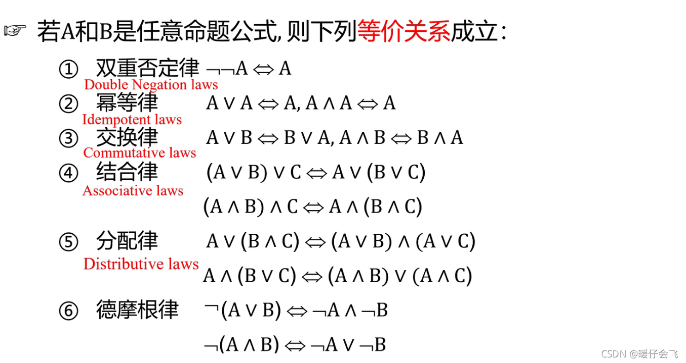
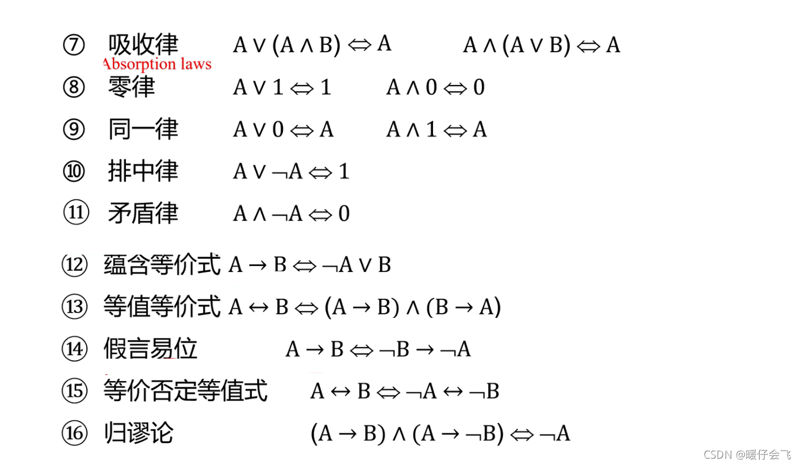

# 离散数学

[离散数学](https://www.bilibili.com/video/BV1jTCNYdEoV?spm_id_from=333.788.videopod.sections&vd_source=1925e38de9174c77ef2d3cfdc2dea75d)

## 第一章 命题逻辑

### 1.1 命题及联结词

#### 1.1.1 命题及其表示

命题：指具有**确定真值**的**陈述句**。

命题标识符：使用 P，Q，R，S，···表示命题。

命题标识符分为**命题变量**（可以表示任何命题）和**命题常量**（只能表示一个固定的命题）。

命题又分为**简单命题**和**复合命题**。

简单命题（又称为原子命题）：是指不能分解为更简单命题的命题。

复合命题：是指由联结词、标点符号把几个原子命题联结起来的命题。

#### 1.1.2 命题联结词

##### 否定

“否定”联结词：记为“¬”

##### 合取

“合取”联结词：记为“∧”，表示“与”

##### 析取

“析取”联结词：记为“∨”，表示“或”

##### 单条件

“单条件”联结词：记为“→”，表示“若…则…”

也可称为“蕴含”

##### 双条件

“双条件”联结词：记为“↔”，表示“当…时…”，相当于“当且仅当”

### 1.2 命题公式与真值表

#### 1.2.1 命题公式

命题公式：是指由命题标识符、命题联结词和标点符号组成的命题。

其本身不是命题，没有真值，只有对其命题变量进行赋值后，命题公式才有真值。

符合以下规则：

1. 命题变量是命题公式。
2. 如果A是公式，那么反A也是公式。
3. 如果A和B是公式，那么（A∧B）、（A∨B）、（A→B）、（A↔B）也是公式。
4. 当且仅当**有限次**地应用1、2、3规则所得到的包含**命题变量**、**联结词**和**圆括号**的符号串是命题公式。

#### 1.2.2 真值表

真值表：是指对命题变量进行赋值后，命题公式的真值。

#### 1.2.3 命题公式的分类

##### 永真式（重言式）

永真式：给定一个命题公式，若在所有赋值下命题公式取值都为1，则称该命题公式为永真式。

##### 永假式（矛盾式）

永假式：给定一个命题公式，若在所有赋值下命题公式取值都为0，则称该命题公式为永假式。

##### 可满足式

可满足式：给定一个命题公式，若命题公式在某些赋值下取值至少有一个为1，则称该命题公式为可满足式。

#### 1.2.4 命题公式的等值演算

命题公式的等值演算：是指将命题公式中的两个等价的命题公式替换为另一个等价的命题公式的过程。

若两个不同的命题公式有相同的真值表，则称公式A等价于公式B。（A ≡ B）（A <=> B）

一些基本的命题定律：

- 双重否定律：A ≡ ¬¬A
- 幂等律：A ≡ A ∧ A | A ≡ A ∨ A
- 交换律：A ∨ B ≡ B ∨ A | A ∧ B ≡ B ∧ A
- 结合律：A ∨ (B ∨ C) ≡ (A ∨ B) ∨ C | A ∧ (B ∧ C) ≡ (A ∧ B) ∧ C
- 分配律：A ∨ (B ∧ C) ≡ (A ∨ B) ∧ (A ∨ C) | A ∧ (B ∨ C) ≡ (A ∧ B) ∨ (A ∧ C)
- 吸收律：A ∧ (A ∨ B) ≡ A | A ∨ (A ∧ B) ≡ A
- 德摩根律：¬(A ∨ B) ≡ ¬A ∧ ¬B | ¬(A ∧ B) ≡ ¬A ∨ ¬B
- 同一律：A ∨ 0 ≡ A | A ∧ 1 ≡ A
- 零律：A ∧ 0 ≡ 0 | A ∨ 1 ≡ 1
- 排中律：A ∨ ¬A ≡ 1
- 矛盾律：A ∧ ¬A ≡ 0
- **蕴含等值律**：A → B ≡ ¬A ∨ B
- **假言异位律**：A → B ≡ ¬B → ¬A
- **等价等值律**：A ↔ B ≡ (A → B) ∧ (B → A)

子公式：设A是一个命题公式，B是A的一部分，且B也是一个命题公式，则称B是A的**子公式**。

若将一个式子的子公式替换为另一个式子的子公式，则称两个式子等价。

### 1.3 命题公式的范式与主范式

文字：命题变元或命题变元的否定式。

#### 1.3.1 析取范式与合取范式

简单析取式：是指由有限个**文字**通过**析取**联结词组成的命题公式。

简单合取式：是指由有限个**文字**通过**合取**联结词组成的命题公式。

> 显然，简单析取式是重言式当且仅当它含有同一个变元及其该变元的否定。（A ∨ ¬A）
> 显然，简单合取式是矛盾式当且仅当它含有同一个变元及其该变元的否定。（A ∧ ¬A）

析取范式：一个命题公式称为析取范式当且仅当他的所有项通过**析取联结词**联结而成，且每个项都是**简单合取式**。

合取范式：一个命题公式称为合取范式当且仅当他的所有项通过**合取联结词**联结而成，且每个项都是**简单析取式**。

将一个命题公式转化为析取范式或合取范式的方法：利用基本的命题等价公式将公式转化为要求的范式。

#### 1.3.2 主范式

极小项：设命题有n个变元，由这n个命题变元及其它们的否定按照一定的顺序（字母顺序或变元顺序）构成的**简单合取式**称为**极小项**，其中每个变元与它的否定不能同时出现，但必须出现一个。

极大项：···构成的**简单析取式**称为**极大项**···

一般来说，n个命题变元可以构成$2^n$个极小项和$2^n$个极大项。

极小项的编码规则：命题变元及其否定分别为1和0。

极大项的编码规则：命题变元及其否定分别为0和1。

|极小项的性质|极大项的性质|
|---|---|
|每个极小项有且仅有一个成真赋值|每个极大项有且仅有一个成假赋值|
|成真赋值与该极小项的编码下标一致|成假赋值与该极大项的编码下标一致|
|任意两个不同极小项的合取为永假式|任意两个不同极大项的析取为永真式|
|全体极小项的析取为永真式|全体极大项的合取为永假式|

主析取范式：设A是一个命题公式，如果A等价于$A_1$到$A_k$的析取，且$A_1$到$A_k$都是极小项，则从$A_1$到$A_k$的析取是公式A的主析取范式。

主合取范式：设A是一个命题公式，如果A等价于$A_1$到$A_k$的合取，且$A_1$到$A_k$都是极大项，则从$A_1$到$A_k$的合取是公式A的主析合范式。

##### 主范式的性质

1. 主析取范式与主合取范式具有互补性
2. 重言式的主析取范式时全体极小项的析取，其主合取范式规定为1；矛盾式的主合取范式时全体极大项的合取，其主析取范式规定为0。
3. 如果两个不同形式的公式等值，则它们的真值表相同，因而它们有相同的主范式。
4. n个命题变元可以构成$2^n$个极小项，$2^n$个极小项可以构成$2^{2^n}$个不等值的主析取范式，因而，**n个命题变元可以构成$2^{2^n}$个不等值的命题公式**。

##### 主范式的主要用途

1. 规范命题公式的形式。
2. 求公式的成真赋值和成假赋值。
3. 判定公式是否等值。
4. 其他。

### 1.4 联结词的完备集

#### 1.4.1 n元真值函数

n元函数就是有**n个自变量**的函数，n元真值函数就是自变量和函数值都是真值的函数。

n元真值函数有$2^{2^n}$个。

#### 1.4.2 联结词的完备集

设 S 是一个联结词集合，如果任何 n （n >= 1）元真值函数都可以由仅含 S 中的联结词构成的公式表示，则称 S 是**联结词完备集**。

#### 1.4.3 单元联结词构成的联结词完备集

##### 与非

P$\uparrow$Q为真当且仅当<u>P与Q不同时为真</u>

##### 或非

P$\downarrow$Q为真当且仅当<u>P与Q同时为假</u>

### 1.5 命题推理理论

命题推理理论是**逻辑学**的一门研究，它研究了**命题逻辑**，即**命题**之间如何通过**逻辑关系**进行推理。

设$H_1，H_2，...，H_n$，B都是命题公式，要证明B是前面一长串命题公式的有效结论

关键是要证明$H_1,H_2,...,H_n\rightarrow B$是一个重言式。

#### 构造论证的方法

这些方法需要一些等值定律和推理规则：

##### 等值定律

##### 推理规则

##### 1. 附加前提法（CP规则法）

将结论的前件作为一个已知条件和已有的已知条件一起证明结论后件的方法称为**附加前提法（CP规则法）**。

##### 2. 归谬法（反证法）

将证明$H_1,H_2,...,H_n\rightarrow B$是一个**重言式**

转化为

证明$H_1 \wedge H_2 \wedge ... \wedge H_n \wedge \lnot C$是一个**矛盾式**的方法称为**谬取法（反证法）**。

## 第三章 集合
