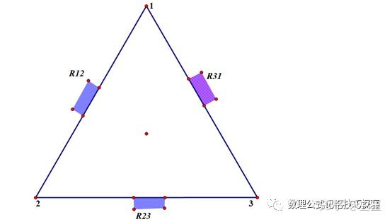
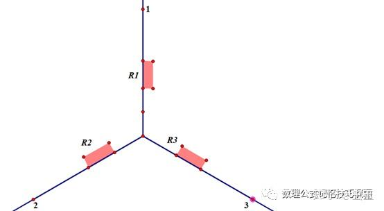
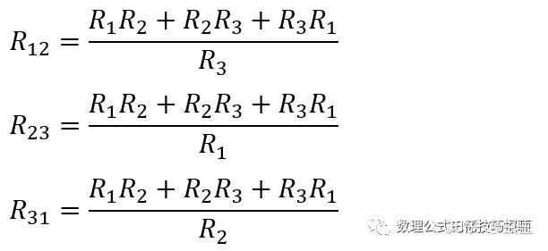
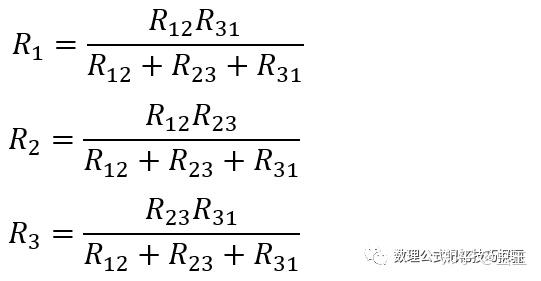

# 自动控制原理

## 第一章

### 题型一 - 判断系统的类型

1. 按是否形成回路分成开环控制系统和闭环控制系统
2. 按系统元件的特性分为线性控制系统和非线性控制系统
3. 按系统传递的信号的形式分为连续控制系统和离散控制系统
4. 按照系统的输出是否随输入作用的时刻发生变化分为时变系统和定长系统

#### 判断线性和非线性

非线性方程的特点是方程中含有变量及其导数的高次幂或乘积项

#### 判断时变和非时变

看方程的系数是否和时间有关

### 知识补充 - 拉氏变换

## 第二章

### 自动控制原理中的两种数学模型

#### 微分方程模型

#### S域模型

### 典型环节的传递函数

### 题型一 - 系统方框图与梅森公式

### 题型二 - 系统方框图化简

- 引出点前移（乘以跨过的方框的值）
- 引出点后移（除以跨过的方框的值）

- 比较点前移（除以跨过的方框的值）
- 比较点后移（乘以跨过的方框的值）

### 题型三 - 系统方框图化为信号流图

### 题型四 - 常见系统建模

#### 电路模型

使用复阻抗法

##### 知识补充 - Y形三角形变换

三角要3p

猩猩是单身

