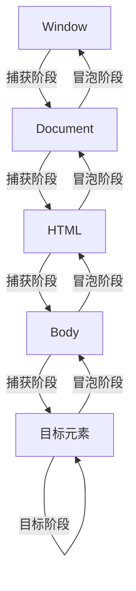

一个月时间


## Day1

### 1、JS简介

#### 1. JS是什么：

是一种运行在**客户端（客户端）** 的编程语言，实现**人机互动**。

#### 2. 作用：

* 网页特效。
* 表单验证。
* 数据交互。

#### 3. 组成：

ECMAScript、web APIs（DOM、BOM）

### 2、JS书写位置

#### 1. 内部JS

直接写在HTML文件里，用script标签包住。

script要写在</body\>上面（写在下面保证加载）

#### 2. 外部JS

代码写在 .js 文件里

在script标签中引用

#### 3. 内联JS

### 3、注释和结束符

* 单行注释，//
* 块注释，/* */

结束符为分号，可以省略

### 4、输入输出语法

#### 1. 输出语法：

```javascript
document.write('')
/*
   作用：向body内输出内容
   注意：如果输出的内容写的是标签，也会被解析成网页元素
*/
alert('') // 页面弹出
console.log('') // 控制台渲染
```

#### 2. 输入语法：

```javascript
prompt('')
```

alert 和 prompt会先被渲染

### 5、字面量

#### 1. 变量

变量是一个存储数据的容器。

`let`

* **作用域**：块级作用域（block-scoped）。
* **提升**：变量声明会被提升，但不会初始化，存在暂时性死区（TDZ）。
* **重复声明**：不允许重复声明。

```javascript
let y = 10;
if (true) {
    let y = 20; // 不同的变量
}
console.log(y); // 输出 10
```

#### 2. 常量

在 JavaScript 中，常量是指值不能被重新赋值的变量。使用 `const` 关键字可以声明常量。常量的值在声明时必须初始化，并且在后续代码中不能被修改。

---

##### **声明常量的语法**

```javascript
const CONSTANT_NAME = value;
```

* `CONSTANT_NAME`：常量的名称，通常使用全大写字母和下划线分隔单词（如 `MAX_USERS`）。
* `value`：常量的初始值，必须在声明时赋值。

---

##### **常量的特点**

1. **不可重新赋值**：

    * 使用 `const` 声明的常量不能被重新赋值。
    * 如果尝试重新赋值，会抛出错误。

    ```javascript
    const PI = 3.14159;
    // PI = 3.14; // 报错：Assignment to constant variable.
    ```
2. **块级作用域**：

    * `const` 声明的常量是块级作用域（block-scoped），只能在声明它的块（如 `{}`）内访问。

    ```javascript
    if (true) {
        const MAX_USERS = 100;
        console.log(MAX_USERS); // 输出 100
    }
    // console.log(MAX_USERS); // 报错：MAX_USERS 未定义
    ```
3. **声明时必须初始化**：

    * `const` 声明的常量必须在声明时赋值，否则会报错。

    ```javascript
    // const MAX_USERS; // 报错：Missing initializer in const declaration
    const MAX_USERS = 100; // 正确
    ```
4. **对象和数组的内容可以修改**：

    * `const` 只保证变量名绑定的内存地址不变，但对于对象或数组，其内容可以修改。

    ```javascript
    const user = { name: "Alice" };
    user.name = "Bob"; // 允许修改对象属性
    console.log(user); // 输出 { name: "Bob" }

    const numbers = [1, 2, 3];
    numbers.push(4); // 允许修改数组
    console.log(numbers); // 输出 [1, 2, 3, 4]
    ```

---

##### **常量的命名规范**

* 常量名通常使用全大写字母，并用下划线（`_`）分隔单词。
* 这种命名方式有助于区分常量和普通变量。

```javascript
const MAX_USERS = 100;
const API_KEY = "12345";
const DEFAULT_TIMEOUT = 5000;
```

---

##### **常量 vs 变量**

* **常量（****`const`** **）** ：

  * 值不能被重新赋值。
  * 必须在声明时初始化。
  * 适用于不会改变的值（如配置、数学常数等）。
* **变量（****`let`** **）** ：

  * 值可以被重新赋值。
  * 可以在声明后初始化。
  * 适用于可能改变的值。

---

##### **示例代码**

```javascript
// 声明常量
const PI = 3.14159;
const MAX_USERS = 100;
const API_KEY = "12345";

// 常量对象
const user = {
    name: "Alice",
    age: 25
};
user.age = 26; // 允许修改对象属性
console.log(user); // 输出 { name: "Alice", age: 26 }

// 常量数组
const colors = ["red", "green", "blue"];
colors.push("yellow"); // 允许修改数组
console.log(colors); // 输出 ["red", "green", "blue", "yellow"]

// 尝试重新赋值常量（会报错）
// PI = 3.14; // 报错：Assignment to constant variable.
```

---

##### **总结**

* 使用 `const` 声明常量，确保值不会被重新赋值。
* 常量名通常使用全大写字母和下划线分隔单词。
* 对于对象或数组，`const` 只保证变量名绑定的内存地址不变，内容可以修改。

#### 3. 数据类型（弱数据类型语言）

* JavaScript 的数据类型分为 **原始类型** 和 **引用类型**。
* 原始类型包括 `number`、`string`、`boolean`、`undefined`、`null`、`symbol` 和 `bigint`。
* 引用类型包括 `object`、`array`、`function`、`date`、`regexp` 等。
* 使用 `typeof` 和 `instanceof` 可以检测数据类型。

##### 模板字符串

```javascript
`我今年${age}岁了` // 用反引号`包裹内容
```

##### 隐式转换和显式转换

在JavaScript中，数据类型转换分为两类：**隐式转换（Implicit Conversion）**  和 **显式转换（Explicit Conversion）** 。以下是详细说明：

隐式转换

隐式转换是指JavaScript自动进行的数据类型转换，通常发生在以下情况：

> 1. 构造器调用
>
> * `"hi".substring(1);`
>
>   * `"hi"` 被隐式转换为 `String()`, 但由于 `"hi"` 本身就是字符串，所以无变化。结果是 `"i"`。
>
> 2. 一元操作符
>
> * `+ obj` 会调用 `obj.valueOf()` 或 `obj.toString()`，然后将其转换为数字。
> * `- obj` 同上，但会转换为负数。
> * `! obj` 或 `!! obj` 会将 `obj` 转换为布尔值。
>
> 3. 比较运算
>
> * 当使用 `==`（全等运算符）时，如果两边类型不同，JavaScript会尝试将它们转换为相同的类型再进行比较。
>
> 4. 数值运算
>
> * 如果操作数包含非数字类型的值，JavaScript会尝试将它们转换为数字。
>
>   * 例如：`"5" + 3`，结果是字符串 `"53"`（隐式转换为字符串）。
>   * `100 + true`，结果是 `101`（`true` 转换为 `1`）。
>
> 5. 布尔运算
>
> * `if (obj)` 中，`obj` 会被隐式转换为布尔值。
>
>   * 如果 `obj` 是 `null`、`undefined`、`0`、`NaN`、`false` 或空字符串 `""`，则转换为 `false`。
>   * 其他任何值转换为 `true`。
>
> 6. 字符串拼接
>
> * 如果任何一个操作数是字符串，另一个操作数会被转换为字符串并进行拼接。

显式转换

显式转换是指开发者手动进行的数据类型转换，通常通过内置函数或方法。

> 1. 数值转换
>
> * **parseInt()** : 将字符串转换为整数。
>
>   ```javascript
>   parseInt("123abc"); // 输出: 123
>   parseInt("abc123"); // 输出: NaN
>   ```
> * **parseFloat()** : 将字符串转换为浮点数。
>
>   ```javascript
>   parseFloat("123.45abc"); // 输出: 123.45
>   ```
> * **Number()** : 将值转换为数字。
>
>   ```javascript
>   Number("123"); // 123
>   Number("123.45"); // 123.45
>   Number("abc"); // NaN
>   ```
>
> 2. 布尔值转换
>
> * **Boolean()** : 将值转换为布尔值。
>
>   ```javascript
>   Boolean(0); // false
>   Boolean(1); // true
>   Boolean("hello"); // true
>   Boolean(""); // false
>   ```
>
> 3. 字符串转换
>
> * **toString()** : 将值转换为字符串。
>
>   ```javascript
>   var num = 123;
>   num.toString(); // "123"
>   ```
>
> 4. 其他转换
>
> * **`null`** **和** **`undefined`** **的转换**
>
>   * `null` 转换为数字时是 `0`，转换为布尔值时是 `false`。
>   * `undefined` 转换为数字时是 `NaN`，转换为布尔值时是 `false`。
>
> JSON格式相关转换
>
> * **`JSON.stringify()`** : 将 JavaScript 对象或值转换为 JSON 字符串。
>
>   ```javascript
>   JSON.stringify({ name: "Alice", age: 25 }); // 输出: '{"name":"Alice","age":25}'
>   ```
>
> **隐式转换的优劣**
>
> * **优点**：
>
>   * 简化了代码，使某些操作更加方便，比如直接拼接字符串。
> * **缺点**：
>
>   * 可能导致意外的类型转换和错误，特别是在数值运算和布尔比较时。
>
> 例如：
>
> ```javascript
> var a = "10";
> var b = 5;
> var c = a + b; // 结果是 "105" 而不是 15
> ```
>
> **建议尽量多使用显式转换**，例如在进行数值运算时使用 `Number()` 或 `parseInt()`，以避免隐式转换带来的潜在问题。

#### 4. 运算符

* `+`：加法。
* `-`：减法。
* `*`：乘法。
* `/`：除法。
* `%`：求模（返回余数）。
* `**`：乘方。

小括号 `(   )`（改变运算优先顺序）

## Day2

### 1、运算符

#### 1. 赋值运算符

| 运算符 | 描述       | 示例 | 等价于 |
| -------- | ------------ | ------ | -------- |
| `=`       | 直接赋值   | `x = 5`     | `x = 5`       |
| `+=`       | 加后赋值   | `x += 3`     | `x = x + 3`       |
| `-=`       | 减后赋值   | `x -= 2`     | `x = x - 2`       |
| `*=`       | 乘后赋值   | `x *= 4`     | `x = x * 4`       |
| `/=`       | 除后赋值   | `x /= 2`     | `x = x / 2`       |
| `%=`       | 取模后赋值 | `x %= 3`     | `x = x % 3`       |
| `**=`       | 指数后赋值 | `x **= 2`     | `x = x ** 2`       |

#### 2. 一元运算符

##### 自增运算符

| 运算符 | 描述 | 示例 | 结果 |
| -------- | ------ | ------ | ------ |
| `++`       | 递增 | `let x=5; x++`     | `x=6`     |
| `--`       | 递减 | `let y=5; y--`     | `y=4`     |

前置自增，先加；后置自增，后加。

##### 比较运算符

| 运算符 | 描述                   | 示例 | 结果 |
| -------- | ------------------------ | ------ | ------ |
| `==`       | 值相等（自动类型转换） | `5 == "5"`     | `true`     |
| `===`       | 严格相等（值和类型）   | `5 === "5"`     | `false`     |
| `!=`       | 值不等                 | `5 != "6"`     | `true`     |
| `!==`       | 严格不等               | `5 !== "5"`     | `true`     |
| `>`       | 大于                   | `10 > 5`     | `true`     |
| `<`       | 小于                   | `3 < 2`     | `false`     |
| `>=`       | 大于等于               | `5 >= 5`     | `true`     |
| `<=`       | 小于等于               | `4 <= 3`     | `false`     |

**注意**：推荐使用 `===` 和 `!==` 避免隐式类型转换错误。

##### 逻辑运算符

| 运算符 | 描述   | 示例 | 结果 |
| -------- | -------- | ------ | ------ |
| `&&`       | 逻辑与 | `true && false`     | `false`     |
| `!`       | 逻辑非 | `!true`     | `false`     |

|| 逻辑或

#### 3. 三元运算符

```javascript
条件 ? 表达式1 : 表达式2
```

* **执行逻辑**：

  * 若 `条件` 为 `true`，返回 `表达式1` 的值。
  * 若 `条件` 为 `false`，返回 `表达式2` 的值。

### 2、语句

以下是 JavaScript 中 **常用语句** 的分类详解，涵盖语法、用途及示例代码：

---

#### **一、条件控制语句（分支语句）**

##### 1. `if...else`

* **用途**：根据条件执行不同代码块。
* **语法**：

  ```javascript
  if (条件1) {
    // 条件1为真时执行
  } else if (条件2) {
    // 条件2为真时执行
  } else {
    // 其他情况执行
  }
  ```
* **示例**：

  ```javascript
  const score = 85;
  if (score >= 90) {
    console.log("优秀");
  } else if (score >= 60) {
    console.log("及格");
  } else {
    console.log("不及格");
  }
  ```

##### 2. `switch`

* **用途**：多分支条件判断（值严格相等时使用）。
* **语法**：

  ```javascript
  switch (表达式) {
    case 值1:
      // 匹配值1时执行
      break;
    case 值2:
      // 匹配值2时执行
      break;
    default:
      // 默认执行
  }
  ```
* **示例**：

  ```javascript
  const day = "Monday";
  switch (day) {
    case "Monday":
      console.log("工作日开始");
      break;
    case "Saturday":
      console.log("休息日");
      break;
    default:
      console.log("其他日期");
  }
  ```

---

#### **二、循环语句**

##### 1. `for`

* **用途**：已知循环次数的迭代。
* **语法**：

  ```javascript
  for (初始化; 条件; 迭代) {
    // 循环体
  }
  ```
* **示例**：

  ```javascript
  for (let i = 0; i < 5; i++) {
    console.log(i);  // 输出0,1,2,3,4
  }
  ```

##### 2. `while`

* **用途**：条件为真时持续循环。
* **语法**：

  ```javascript
  while (条件) {
    // 循环体
  }
  ```
* **示例**：

  ```javascript
  let count = 0;
  while (count < 3) {
    console.log(count);  // 输出0,1,2
    count++;
  }
  ```

##### 3. `do...while`

* **用途**：至少执行一次循环体，再判断条件。
* **语法**：

  ```javascript
  do {
    // 循环体
  } while (条件);
  ```
* **示例**：

  ```javascript
  let num = 5;
  do {
    console.log(num);  // 输出5
    num++;
  } while (num < 3);
  ```

##### 4. `for...of`（ES6）

* **用途**：遍历可迭代对象（数组、字符串等）。
* **语法**：

  ```javascript
  for (const 元素 of 可迭代对象) {
    // 处理元素
  }
  ```
* **示例**：

  ```javascript
  const colors = ["red", "green", "blue"];
  for (const color of colors) {
    console.log(color);  // 依次输出数组元素
  }
  ```

##### 5. `for...in`

* **用途**：遍历对象的可枚举属性（通常用于对象，而非数组）。
* **语法**：

  ```javascript
  for (const 键 in 对象) {
    // 处理键
  }
  ```
* **示例**：

  ```javascript
  const person = { name: "Alice", age: 25 };
  for (const key in person) {
    console.log(`${key}: ${person[key]}`); // 输出 name: Alice, age:25
  }
  ```

---

#### **三、跳转语句**

##### 1. `break`

* **用途**：退出循环或 `switch` 语句。
* **示例**：

  ```javascript
  for (let i = 0; i < 10; i++) {
    if (i === 5) break;
    console.log(i);  // 输出0,1,2,3,4
  }
  ```

##### 2. `continue`

* **用途**：跳过当前循环，进入下一次迭代。
* **示例**：

  ```javascript
  for (let i = 0; i < 5; i++) {
    if (i === 2) continue;
    console.log(i);  // 输出0,1,3,4
  }
  ```

##### 3. `return`

* **用途**：从函数中返回值并退出。
* **示例**：

  ```javascript
  function sum(a, b) {
    return a + b;
  }
  console.log(sum(2, 3)); // 输出5
  ```

---

#### **四、错误处理语句**

##### 1. `try...catch...finally`

* **用途**：捕获和处理运行时错误。
* **语法**：

  ```javascript
  try {
    // 可能出错的代码
  } catch (error) {
    // 错误处理
  } finally {
    // 无论是否出错都会执行
  }
  ```
* **示例**：

  ```javascript
  try {
    const data = JSON.parse("{ invalid JSON }");
  } catch (e) {
    console.error("解析错误:", e.message); // 输出错误信息
  } finally {
    console.log("处理完成");
  }
  ```

##### 2. `throw`

* **用途**：主动抛出错误。
* **示例**：

  ```javascript
  function checkAge(age) {
    if (age < 0) throw new Error("年龄不能为负数");
    return age;
  }
  ```

---

#### **~~五、其他语句~~**

##### 1. `debugger`

* **用途**：在代码中设置断点（需开发者工具支持）。
* **示例**：

  ```javascript
  function test() {
    debugger; // 执行到此会暂停
    console.log("Debugging...");
  }
  ```

##### 2. 标签语句

* **用途**：标识代码块，与 `break` 或 `continue` 配合使用。
* **示例**：

  ```javascript
  outerLoop: for (let i = 0; i < 3; i++) {
    for (let j = 0; j < 3; j++) {
      if (i === 1 && j === 1) break outerLoop; // 跳出外层循环
      console.log(i, j);
    }
  }
  ```

##### 3. `with`（已弃用）

* **用途**：简化对象属性访问（不推荐使用，易引发作用域问题）。
* **示例**：

  ```javascript
  const obj = { x: 10, y: 20 };
  with (obj) {
    console.log(x + y); // 30
  }
  ```

---

#### **~~六、ES6+ 新增特性~~**

##### 1. 解构赋值

* **用途**：从数组或对象中提取值。
* **示例**：

  ```javascript
  // 数组解构
  const [a, b] = [1, 2]; // a=1, b=2

  // 对象解构
  const { name, age } = { name: "Bob", age: 30 };
  ```

##### 2. 模板字符串（反引号）

* **用途**：支持多行字符串和变量插值。
* **示例**：

  ```javascript
  const name = "Alice";
  const greeting = `Hello, ${name}!
  Welcome to JS.`;  // 多行文本
  ```

---

#### **总结**

| **语句类型**                     | **典型场景**               | **注意事项**                               |
| ---------------------- | ---------------- | -------------------------------- |
| 条件语句 (`if/switch`)          | 多分支逻辑判断 | `switch` 需配合 `break`                       |
| 循环语句 (`for/while`)          | 重复执行代码块 | 避免无限循环，优先 `for...of` 遍历数组   |
| 跳转语句 (`break/return`)          | 控制代码流程   | `return` 只能在函数中使用              |
| 错误处理 (`try...catch`)          | 增强代码健壮性 | 避免过度捕获，finally 始终执行 |
| 解构赋值和模板字符串 | 简化代码编写   | 模板字符串避免复杂逻辑嵌入     |

通过灵活组合这些语句，可以高效实现复杂的程序逻辑和数据处理！

## Day3

### 1、数组

数组是JavaScript中一种非常重要的数据结构，它用于存储一系列有序的数据。以下是一些关于数组的关键点：

#### 数组的声明与初始化

```javascript
// 声明一个空数组
let arr = [];

// 声明一个包含数据的数组
let numbers = [1, 2, 3, 4, 5];
let fruits = ['apple', 'banana', 'orange'];
```

#### 数组的索引

数组的索引从 `0` 开始，可以通过索引来访问数组中的元素：

```javascript
console.log(numbers[0]); // 输出: 1
console.log(numbers[1]); // 输出: 2
console.log(numbers[4]); // 输出: 5
```

#### 添加、修改和删除元素

```javascript
// 添加元素
arr.push(5); // 在数组末尾添加元素 5

// 修改元素
arr[0] = 10; // 修改索引为 0 的元素为 10

// 删除元素
delete arr[0]; // 删除索引为 0 的元素
```

#### 数组的常用操作

* **连接数组**

  ```javascript
  let arr1 = [1, 2];
  let arr2 = [3, 4];
  let arr3 = arr1.concat(arr2); // 结果为 [1, 2, 3, 4]
  ```
* **反转数组**

  ```javascript
  let arr4 = [1, 2, 3, 4].reverse(); // 结果为 [4, 3, 2, 1]
  ```
* **排序数组**

  ```javascript
  let arr5 = ['banana', 'apple', 'orange'].sort(); // 结果为 ['apple', 'banana', 'orange']
  ```

#### 遍历数组

```javascript
for (let i = 0; i < arr.length; i++) {
  console.log(arr[i]);
}

for (let item of arr) {
  console.log(item);
}

arr.forEach(function(item, index) {
  console.log(item, index);
});
```

#### 数组的方法

JS中的数组有许多实用的方法，例如：

* `filter()` 过滤
* `map()` 转换
* `reduce()` 聚合
* `find()` 查找

```javascript
const numbers = [1, 2, 3, 4, 5];

// filter() 过滤
const evenNumbers = numbers.filter(num => num % 2 === 0); // 结果为 [2, 4]

// map() 转换
const squares = numbers.map(num => num * num); // 结果为 [1, 4, 9, 16, 25]

// reduce() 聚合
const sum = numbers.reduce((acc, num) => acc + num, 0); // 结果为 15

// find() 查找
const firstEven = numbers.find(num => num % 2 === 0); // 结果为 2
```

#### 更多方法

`join()，indexOf()，includes()，pop()，push()，shift()，unshift()，map()，filter()，sort()，reverse()，splice()，slice()，concat()，every()，some(), `

#### 数组的降维

```javascript
// 使用flat()方法将多维数组降为一维
let arr6 = [1, [2, 3], [[4]]].flat(); // 结果为 [1, 2, 3, 4]

// 使用flatMap()方法结合map和flat的功能
let arr7 = [1, 2, 3].flatMap(num => [num * 2]); // 结果为 [2, 4, 6]
```

数组是 JavaScript 中非常灵活的数据结构，它的使用非常广泛，是编程中不可或缺的一部分。在实际开发中，要根据具体需求选择合适的方法和操作来处理数组。

## Day4

在 JavaScript 中，函数是编程的核心组成部分之一。以下是函数的基本使用方法和相关知识，帮助你快速掌握函数的使用。

---

### 1. **函数的定义**

函数可以通过以下方式定义：

#### (1) 函数声明

```javascript
function greet(name) {
  return "Hello, " + name + "!";
}
console.log(greet("Alice")); // 输出: Hello, Alice!
```

#### (2) 函数表达式

```javascript
const greet = function(name) {
  return "Hello, " + name + "!";
};
console.log(greet("Bob")); // 输出: Hello, Bob!
```

#### (3) 箭头函数（ES6）

```javascript
const greet = (name) => {
  return "Hello, " + name + "!";
};
// 如果函数体只有一行，可以简写
const greet = (name) => "Hello, " + name + "!";
console.log(greet("Charlie")); // 输出: Hello, Charlie!
```

---

### 2. **函数的调用**

定义函数后，可以通过函数名加括号的方式调用：

```javascript
function sayHello() {
  console.log("Hello!");
}
sayHello(); // 输出: Hello!
```

---

### 3. **函数的参数**

函数可以接受参数，参数是函数运行时传入的值。

#### (1) 基本参数

```javascript
function add(a, b) {
  return a + b;
}
console.log(add(2, 3)); // 输出: 5
```

#### (2) 默认参数（ES6）

如果调用时未传递参数，可以使用默认值：

```javascript
function greet(name = "Guest") {
  return "Hello, " + name + "!";
}
console.log(greet()); // 输出: Hello, Guest!
```

#### (3) 剩余参数（`...`）

用于接收不定数量的参数：

```javascript
function sum(...numbers) {
  return numbers.reduce((acc, num) => acc + num, 0);
}
console.log(sum(1, 2, 3, 4)); // 输出: 10
```

---

### 4. **函数的返回值**

函数可以通过 `return` 返回值。如果没有 `return`，函数默认返回 `undefined`。

```javascript
function multiply(a, b) {
  return a * b;
}
console.log(multiply(2, 3)); // 输出: 6
```

---

### 5. **函数的作用域**

函数内部声明的变量只能在函数内部访问（局部作用域）。

```javascript
function example() {
  const localVar = "I'm local!";
  console.log(localVar); // 输出: I'm local!
}
console.log(localVar); // 报错: localVar is not defined
```

---

### 不常用

#### 6. **函数提升**

函数声明会被提升到作用域的顶部，因此可以在声明之前调用：

```javascript
console.log(greet("Alice")); // 输出: Hello, Alice!
function greet(name) {
  return "Hello, " + name + "!";
}
```

---

#### 7. **匿名函数**

没有名字的函数，通常用作回调函数或立即执行函数。

```javascript
const greet = function(name) {
  return "Hello, " + name + "!";
};
console.log(greet("Bob")); // 输出: Hello, Bob!
```

---

#### 8. **立即执行函数 (IIFE)**

定义后立即执行的函数：

```javascript
(function() {
  console.log("This is an IIFE!");
})();
```

---

#### 9. **回调函数**

将函数作为参数传递给另一个函数，并在特定条件下调用：

```javascript
function processUserInput(callback) {
  const name = prompt("Please enter your name.");
  callback(name);
}

processUserInput(function(name) {
  console.log("Hello, " + name + "!");
});
```

---

#### 10. **箭头函数的特点**

* 更简洁的语法。
* 没有自己的 `this`，会继承外层作用域的 `this`。
* 不能用作构造函数（不能使用 `new`）。

```javascript
const add = (a, b) => a + b;
console.log(add(2, 3)); // 输出: 5
```

---

#### 11. **高阶函数**

接受函数作为参数或返回函数的函数：

```javascript
function higherOrderFunction(callback) {
  return callback();
}

const result = higherOrderFunction(() => "Hello from callback!");
console.log(result); // 输出: Hello from callback!
```

---

#### 12. **闭包**

函数可以访问其词法作用域中的变量，即使函数在其词法作用域之外执行：

```javascript
function outerFunction() {
  const outerVariable = "I'm outside!";

  function innerFunction() {
    console.log(outerVariable);
  }

  return innerFunction;
}

const closure = outerFunction();
closure(); // 输出: I'm outside!
```

---

#### 13. **递归函数**

函数调用自身：

```javascript
function factorial(n) {
  if (n === 0) {
    return 1;
  }
  return n * factorial(n - 1);
}
console.log(factorial(5)); // 输出: 120
```

---

#### 14. **异步函数**

使用 `async` 和 `await` 处理异步操作：

```javascript
async function fetchData() {
  const response = await fetch('https://api.example.com/data');
  const data = await response.json();
  return data;
}

fetchData().then(data => console.log(data));
```

---

#### 15. **方法**

方法是定义在对象中的函数：

```javascript
const obj = {
  greet: function(name) {
    return "Hello, " + name + "!";
  }
};
console.log(obj.greet("Dave")); // 输出: Hello, Dave!
```

---

### 总结

* 函数是 JavaScript 中的核心概念，用于封装可重用的代码。
* 函数可以通过声明、表达式、箭头函数等方式定义。
* 函数可以接受参数、返回值，并且支持高阶函数、闭包、递归等特性。
* 掌握函数的基本用法是学习 JavaScript 的关键一步。

如果你有更多问题，欢迎随时提问！

## Day5

### 1、对象

在 JavaScript 中，对象是一个非常重要的数据类型，它是键值对的集合（也可看作哈希表）。对象的每个键（Key）都是一个字符串（或 Symbol），而对应的值（Value）可以是任何数据类型，包括函数（通常称为方法）。

#### 创建对象

##### 1. **使用对象字面量**

这是最常用的方式，语法简单直观：

```javascript
const person = {
  name: "张三",
  age: 20,
  isStudent: true,
  hobbies: ["阅读", "篮球", "音乐"],
  sayHello: function() {
    console.log("你好，我是" + this.name);
  }
};
```

##### 2. **使用** **`new Object()`**

通过 `Object` 构造函数创建对象：

```javascript
const person = new Object();
person.name = "张三";
person.age = 20;
person.sayHello = function() {
  console.log("你好，我是" + this.name);
};
```

##### 3. **使用构造函数**

定义一个自定义的构造函数：

```javascript
function Person(name, age) {
  this.name = name;
  this.age = age;
  this.sayHello = function() {
    console.log("你好，我是" + this.name);
  };
}

const person = new Person("张三", 20);
```

##### 4. **使用** **`Object.create()`**

通过指定原型对象来创建新对象：

```javascript
const personPrototype = {
  sayHello: function() {
    console.log("你好，我是" + this.name);
  }
};

const person = Object.create(personPrototype);
person.name = "张三";
person.age = 20;
```

#### 访问对象的属性

##### 1. **点语法**

```javascript
console.log(person.name); // 输出：张三
person.age = 21; // 修改属性
```

##### 2. **方括号语法**

适用于属性名是动态字符串的情况：

```javascript
console.log(person["name"]); // 输出：张三
const propertyName = "age";
person[propertyName] = 22; // 修改属性
```

#### 添加和删除属性

##### 1. **添加属性**

直接赋值即可：

```javascript
person.gender = "男"; // 添加一个新属性
```

##### 2. **删除属性**

使用 `delete` 关键字：

```javascript
delete person.age; // 删除属性
```

#### 遍历对象的属性

##### 1. **`for...in`** **循环**

遍历对象的所有可枚举属性（包括继承的属性）：

```javascript
for (const key in person) {
  if (person.hasOwnProperty(key)) { // 检查是否是对象自身的属性
    console.log(`${key}: ${person[key]}`);
  }
}
```

##### 2. **`Object.keys()`**

获取对象自身的所有可枚举属性名：

```javascript
const keys = Object.keys(person);
console.log(keys); // 输出：["name", "gender", "hobbies", "sayHello"]
```

##### 3. **`Object.values()`**

获取对象自身的所有可枚举属性值：

```javascript
const values = Object.values(person);
console.log(values); // 输出：["张三", "男", ["阅读", "篮球", "音乐"], function]
```

#### 检查属性是否存在

使用 `in` 运算符或 `hasOwnProperty()` 方法：

```javascript
if ("name" in person) {
  console.log("person 对象有 name 属性");
}

if (person.hasOwnProperty("age")) {
  console.log("person 对象自身有 age 属性");
}
```

#### 对象的原型和继承

JavaScript 中的对象基于原型实现继承。每个对象都有一个原型（prototype），可以通过 `Object.getPrototypeOf()` 获取：

```javascript
const proto = Object.getPrototypeOf(person);
console.log(proto === Person.prototype); // 输出：true（如果 person 是通过 Person 构造函数创建的）
```

#### 总结

对象是 JavaScript 中的核心数据结构，灵活使用对象可以实现复杂的数据组织和功能实现。通过对象字面量、构造函数或原型链，可以创建和操作对象以满足不同的需求。

## 2. Day1 - DOM - 获取元素

### 1. Web API 基本认知

变量声明，优先使用`const`：

* const 语义化更好
* 很多变量声明的时候就知道不会改变了
* 框架基本使用 const

**数组和对象使用** **`const`**

#### 1. 作用和分类

作用：就是用 js 去操作 html 和浏览器

分类：DOM（文档对象模型）、BOM（浏览器对象模型）。

##### 1.1 DOM

DOM（Document Object Model - 文档对象模型），用来呈现以及与任意 HTML 或 XML 文档交互的API。

用来**操作网页内容**的功能。

##### 1.2 DOM树

将 HTML 结构通过树结构直观表示出来，我们称之为文档树或 DOM树。

直观的表现出标签与标签之间的关系。

##### 1.3 DOM对象

浏览器根据 HTML 标签生成的 JS对象。

DOM的核心思想，就是把网页内容当作对象进行处理。

document对象是 DOM 里提供的一个对象，提供用以**访问和操作网页内容**的属性和方法。

#### 2. 获取DOM元素

##### 2.1 根据CSS选择器获取DOM元素

```javascript
const box = document.querySelector('.box') // 只能获取一个
const boxs = document.querySelectorAll('.box') // 是伪数组
```

#### 3. 操作元素内容

在使用DOM元素的基础上，使用

```javascript
const box = document.querySelector('.box')
const boxs = document.querySelectorAll('.box')
for (let i = 0; i < boxs.length; i++) {
        console.log(boxs[i])
        }
console.log(boxs)
box.innerHTML = '<h1>fire</h1>' // 主要代码
```

以更改文字内容

#### 4. 操作元素属性

##### 1. 常用属性

对于常见的属性，先抓取页面元素为一个对象，再调用对象方法更改其元素。

```javascript
const a = document.querySelector('a')
a.href = 'www.baidu.com'
```

##### 2. 样式属性

###### 1. 通过style属性操作css

```javascript
对象.style.样式属性 = 值
```

内置使用小驼峰命名法：padding-left -> paddingLeft

###### 2. 通过类名修改样式

如果修改的样式比较大，直接通过style属性修改比较繁琐时，可以通过借用css类名的形式

```javascript
元素.className = '类名'
```

`class`是个js关键字，所以使用`className`替代。

###### 3. 通过 classList 修改样式

为了解决className 容易覆盖以前的类名，我们可以通过classList方式追加和删除类名

```javascript
元素.classList.add()
// 追加一个类
元素.classList.remove()
// 删除一个类
元素.classList.toggle()
// 切换一个类 - 有则删除，没有则追加
```

##### 3. 表单元素属性

##### 4. 自定义属性

标准属性：标签天生自带的属性，比如class id title等

自定义属性：

* 在html5中推出了专门的data-自定义属性
* 在标签上一律以data-开头
* 在DOM对象上一律以dataset对象方式获取

##### 5. 定时器，间歇函数

```javascript
// 开启定时器
setInterval(函数，间隔时间）
// 关闭定时器
clearInterval(定时器id)
```

## 2.Day2 - 事件监听（绑定）

### 1.1 事件监听（绑定事件或注册事件）

目标：能够给 DOM 元素添加事件监听

```javascript
元素对象.addEventListener('事件类型', 要执行的函数)
```

> 三要素：
>
> * 事件源：那个DOM元素被事件触发了，要获取DOM元素
> * 事件类型：用什么方式触发，比如鼠标点击 click、鼠标经过 mouseover 等
> * 事件调用的函数：要做什么事

### 1.2 事件类型

> 鼠标触发：
>
> * click 鼠标点击
> * mouseenter 鼠标经过
> * mouseleave 鼠标离开

> 焦点事件：
>
> * focus 获得焦点
> * blur 失去焦点

> 键盘触发：
>
> * keydown 键盘按下触发
> * keyup 键盘抬起触发

> 表单输入：
>
> input 用户输入事件

### 1.3 事件对象

```javascript
元素.addEvenListener('click', function (e) {})
```

> 常见属性：
>
> * type 获取当前的事件类型
> * clientX/clientY 获取相对于浏览器可见窗口左上角的位置
> * offsetX/offsetY 获取光标相对于当前DOM元素左上角的位置
> * key 用户按下的键盘键的值  现在不提倡

### 1.4 环境对象

环境对象：指的是函数内部特殊的变量 `this` ，它代表着当前函数运行时所处的环境。

> 谁调用，this就是谁。

## 2.Day3 - APIS

### 1.1 事件流

#### 基本概念

JavaScript事件流描述了事件从触发到处理的整个过程，包含三个阶段：



1. **捕获阶段（Capture Phase）**

    * 事件从window对象向下传播到目标元素
    * 使用`addEventListener`的第三个参数设置为`true`来监听捕获阶段
2. **目标阶段（Target Phase）**

    * 事件到达目标元素
    * 在目标元素上触发事件处理程序
3. **冒泡阶段（Bubble Phase）**

    * 事件从目标元素向上冒泡回window对象
    * 大多数事件默认会冒泡（除了focus/blur等少数事件）

##### 高级应用场景

1. 动态列表项处理
2. 无限滚动加载
3. 表格行/列交互
4. 嵌套组件通信

```javascript
// 更健壮的事件委托实现
document.getElementById('parent').addEventListener('click', function(e) {
  let target = e.target;
  while (target !== this) {
    if (target.matches('.child')) {
      // 处理子元素点击
      console.log('Clicked child:', target.dataset.id);
      break;
    }
    target = target.parentNode;
  }
});
```

```javascript
document.getElementById('parent').addEventListener('click', function(e) {
  if(e.target.matches('.child')) {
    // 处理子元素点击
  }
});
```

#### 阻止事件传播

* `event.stopPropagation()`: 阻止事件继续传播
* `event.stopImmediatePropagation()`: 阻止事件传播且阻止同元素上其他监听器执行

##### 方法对比

| 方法                       | 作用             | 影响范围                     |
| ---------------------------- | ------------------ | ------------------------------ |
| stopPropagation()          | 阻止事件继续传播 | 不影响当前元素的其他监听器   |
| stopImmediatePropagation() | 阻止事件传播     | 阻止当前元素的其他监听器执行 |
| preventDefault()           | 阻止默认行为     | 不影响事件传播               |

#### 事件解绑

##### removeEventListener注意事项

1. 必须使用相同的参数（包括capture参数）
2. 匿名函数无法解绑
3. 最佳实践：

```javascript
// 使用具名函数
function handleClick(e) { /*...*/ }

element.addEventListener('click', handleClick);
// 正确解绑
element.removeEventListener('click', handleClick);

// 错误示例：匿名函数无法解绑
element.addEventListener('click', function() {});
// 无法解绑，因为没有引用
```

##### 浏览器差异

| 浏览器  | 捕获阶段支持 | 冒泡阶段默认 |
| --------- | -------------- | -------------- |
| Chrome  | 完全支持     | 是           |
| Firefox | 完全支持     | 是           |
| Safari  | 完全支持     | 是           |
| IE9+    | 部分支持     | 是           |
| Edge    | 完全支持     | 是           |

#### 实际应用

1. 表单验证

    ```javascript
    document.querySelector('form').addEventListener('submit', function(e) {
      if (!validateForm()) {
        e.preventDefault();
        e.stopPropagation();
      }
    }, true); // 在捕获阶段验证
    ```
2. 动态加载内容的交互
3. 性能优化（减少事件监听器数量）

#### Event对象详解

##### 常用属性

* `target`: 触发事件的元素
* `currentTarget`: 当前处理事件的元素
* `eventPhase`: 当前事件阶段(1捕获, 2目标, 3冒泡)
* `bubbles`: 是否冒泡
* `cancelable`: 能否取消默认行为

##### 常用方法

* `preventDefault()`: 取消默认行为
* `stopPropagation()`: 停止传播
* `stopImmediatePropagation()`: 停止传播并阻止其他监听器
* `composedPath()`: 获取事件路径数组

### 2.2 事件委托

#### 优点：

减少事件注册次数，提高了性能

#### 原理：

事件委托实际上是利用事件冒泡的机制，即

* 给父元素注册事件，当触发子元素时，会冒泡到父元素上，从而触发父元素的事件。