## 第四章 循环语句

### 1. while：

```python
i = 1
while i <= 10:
    print(i)
    i = i + 1
print(i)
```

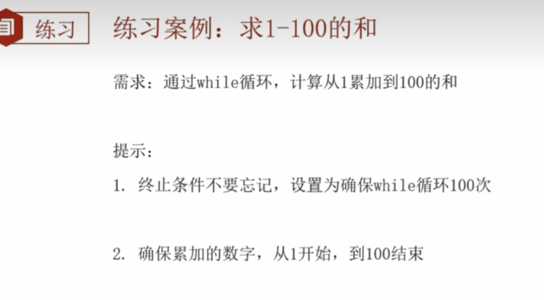

```python
i = 1
num = 0
while i <= 100:
    num = num + i
    i = i + 1
print(num)
```

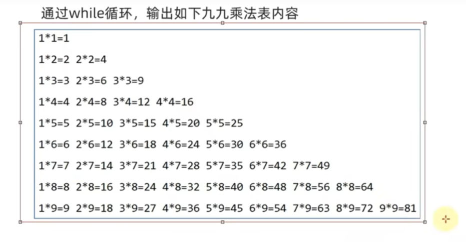

```python
i = 1
j = 1

while i < 10:
    while j < i:
        print(f"{j} * {i} = {i * j}\t", end='')
        j += 1
    print(f"{j} * {i} = {i * j}")
    i += 1
    j = 1
```

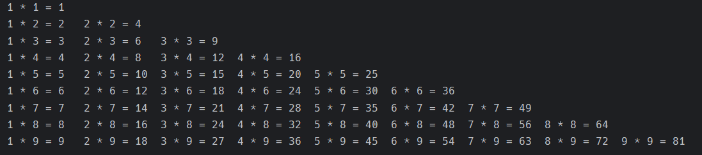

### 2. for：（与 c语言 不同）

for 循环是一种**轮询**机制。

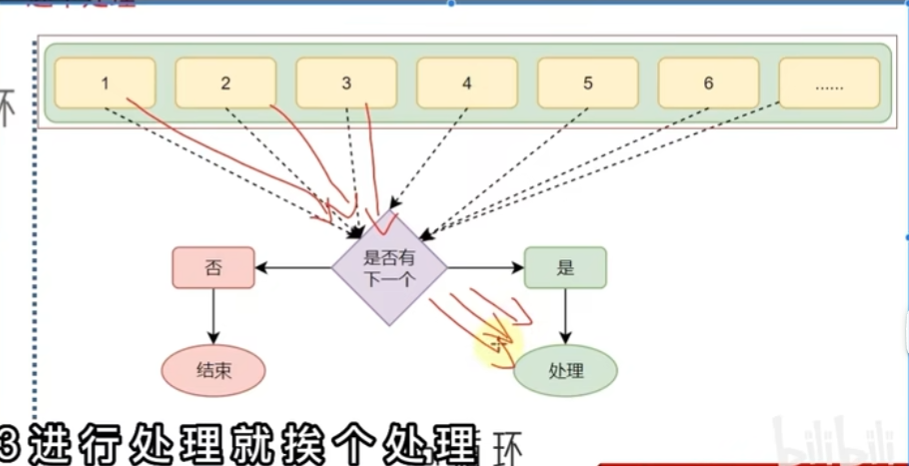

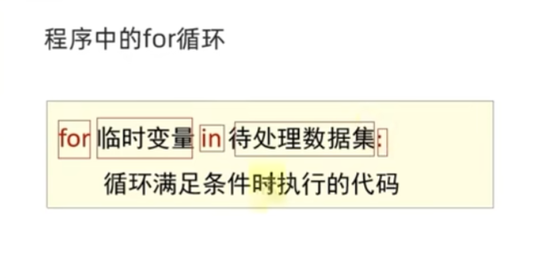


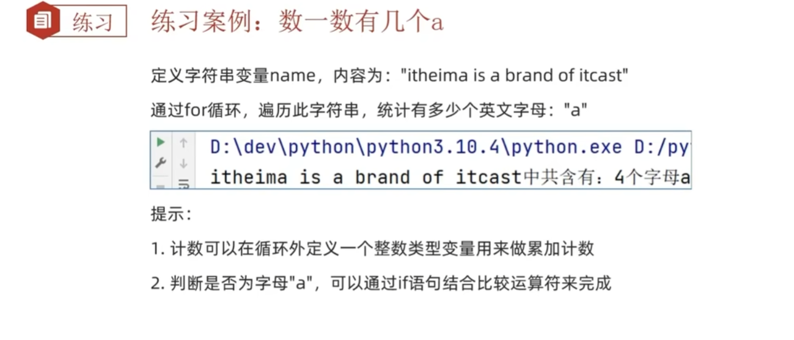

```python
name = "itheiman is a brand of itcast"
count = 0
for x in name:
    if x == "a":
        count += 1
      
print(count)
```


#### range 语句：

所谓的“待处理数据集”，严格来说，应该叫做：序列类型

> 序列类型：其内容可以一个个依次取出的一种类型，包括：
>
> * 字符串
> * 列表
> * 元组
> * 等

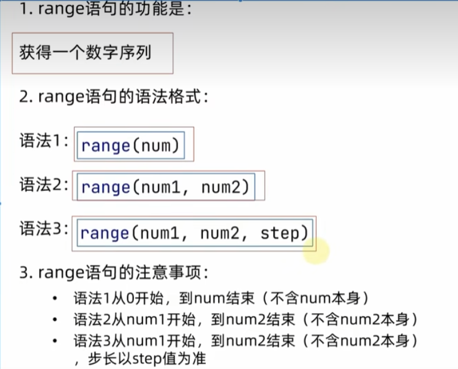


#### 综合案例

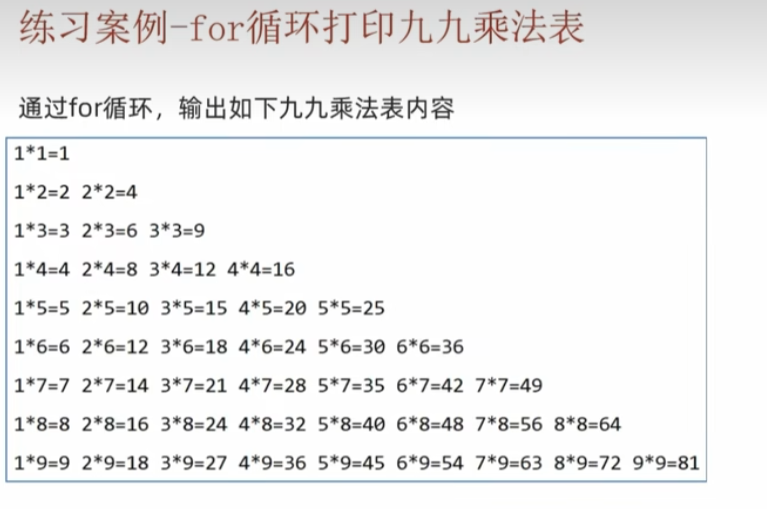

```python
for i in range(1, 10):
    for j in range(1, i + 1):
        if i != j:
            print(f"{j} * {i} = {i * j}\t", end='')
        else:
            print(f"{j} * {i} = {i * j}")
```

### 3. 循环中断：break continue

continue：跳过循环下面的步骤，**重新开始**循环。

break：**中断**整个循环。

## 第五章 函数

### 1. 什么是函数：

函数是**组织好**的，**可重复使用**的，用来实现特定功能的**代码段**。

```python
def my_lan(data):
    cont = 0
    for i in data:
        cont += 1
    print(cont)

my_lan("Cqupt")
# output：5
```

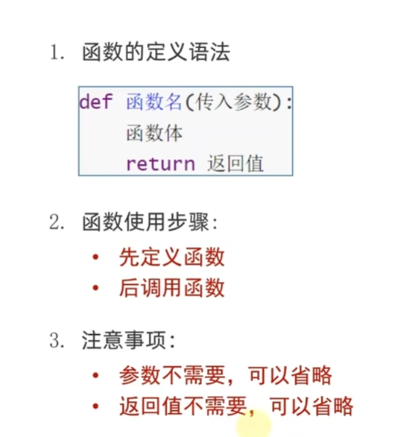

### 2. 函数的参数

函数传入参数的数量不受限制。

### 3. 函数的返回值

return 返回值

#### None类型

### 4. 函数说明文档

### 5. 函数的嵌套调用

### 6. 函数的作用域

局部变量和全局变量

global 声明全局变量

## 第六章 数据容器

### 1. 什么是数据容器

一种可以容纳多份数据的数据类型，容纳的每一份数据称之为1个元素。

每一个元素，可以是任意类型的数据，如字符串、数字、布尔。

被分为五类：列表、元组、字符串、集合、字典

### 2. list 列表

#### 1. 定义

```python
x = [, , , ,]
```

#### 2. 下标索引

正向、反向、列表嵌套索引

#### 3. 常用操作（列表的方法）

* ##### 查找某元素下标

> resalut = my_list.index("查找内容")

* ##### 修改下标索引内容

> my_list[0] = 5

* ##### 插入元素

> my_list.insert(1, "插入内容")

* ##### 追加元素

1. 单个

> my_list.append("元素")

2. 多个

> my_list.extend([])

* ##### 删除元素

1. del 列表[下标]
2. 列表.pop(下标) - 可以把删掉的元素作为返回值
3. 列表.remove(元素)

* ##### 清空列表

列表.clear()

* ##### 统计某元素在列表中的数量

列表.count(元素)

* ##### 统计列表中全部的元素数量

len(列表)

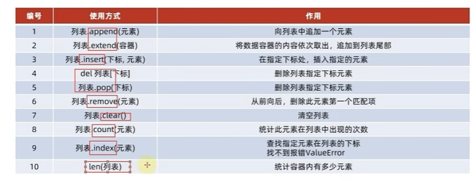

#### 4. 列表的特点

* 可以容纳多个元素
* 可以容纳不同类型的元素（混装）
* 数据是有序存储的（有下标符号）
* 允许重复数据存在
* 可以修改（增加或删除元素）

### 3. 列表的遍历

类似于c，用循环结构对列表进行遍历

### 4. 元组

元组同列表类似，但元组一旦定义完成，就不可被修改。

```python
x = ( , , , , )
y = (54, )
```

#### 1. 元组的操作

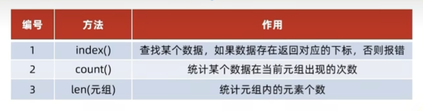

### 5. 字符串

同元组一样，字符串是一个无法修改的数据容器。

#### 1. index

#### 2. replace

替换的是字符串全部内容。

#### 3. split

分隔，将字符串划分为多个字符串，并存入列表对象中。

#### 4. 字符串规整

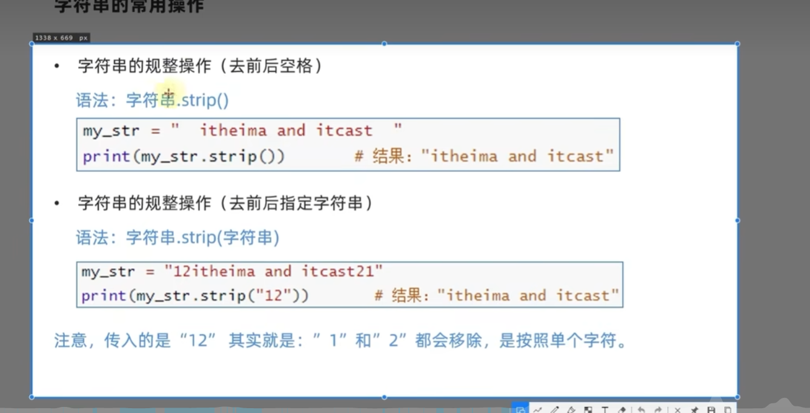

#### 5. count、len

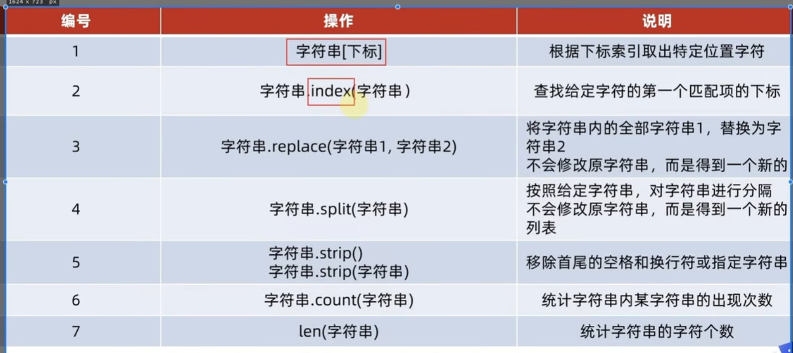

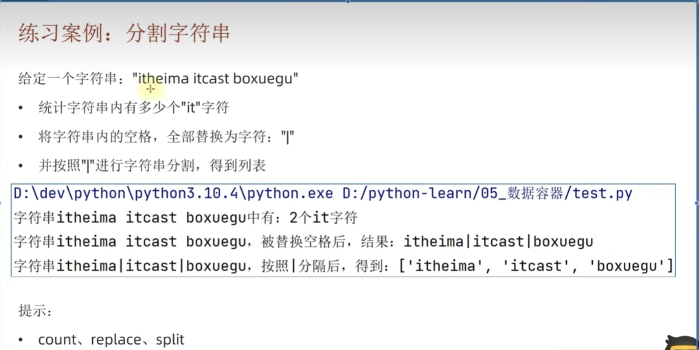

```python
p = "itheima itcast boxuegu"
num_1 = p.count("it")
print(num_1)
p_1 = p.replace(" ", "|")
print(p)
p_1 = p_1.split("|")
print(p_1)
```

### 6. 序列

序列：内容连续、有序、可使用下标索引的一类数据容器。

列表、元组、字符串都可视为序列。

#### 1. 切片

> list = list_old[::]

### 7. 集合

集合，不能有相同元素，并且内部无序。

#### 1. 修改方法

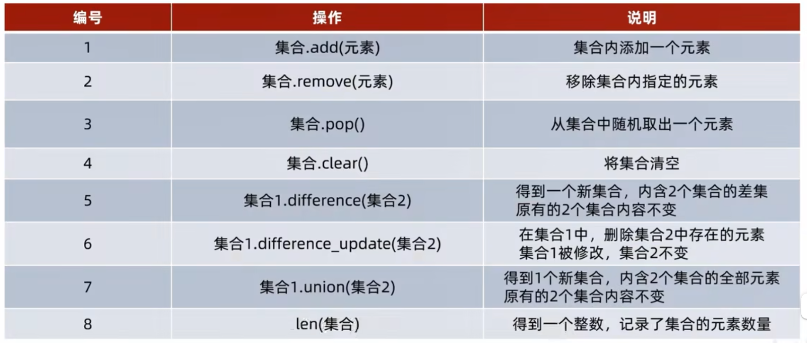

### 8. 字典

一对一的查找，key: value

通过key来取到value。

key不能是字典。

#### 1. 常用操作

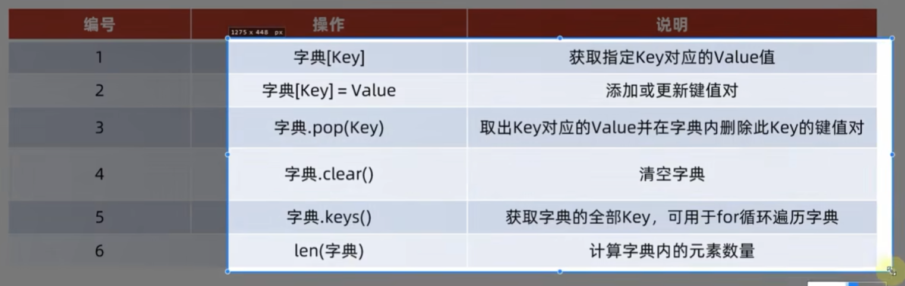

```python
name = {
    '王力宏': {'部门': '科技部', '工资': 3000, '级别': 1},
    '周杰伦': {'部门': '市场部', '工资': 5000, '级别': 2},
    '林俊杰': {'部门': '市场部', '工资': 7000, '级别': 3},
    '张学友': {'部门': '科技部', '工资': 4000, '级别': 1},
    '刘德华': {'部门': '市场部', '工资': 6000, '级别': 2}
}
print(f"全体员工当前信息如下，\n{name}")
for name_key in name:
    if name[name_key]['级别'] == 1:
        name[name_key]['级别'] += 1
        name[name_key]['工资'] += 1000

print(f"全体级别为1的员工完成升职加薪操作，操作后，当前信息如下，\n{name}")
```

### 9. 总结

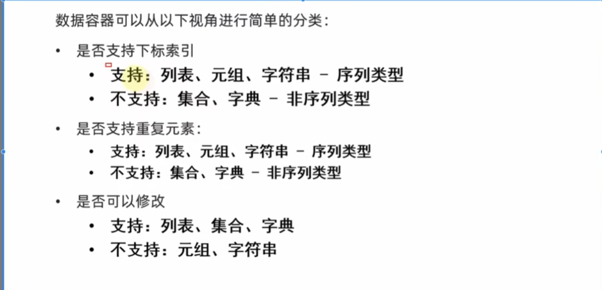

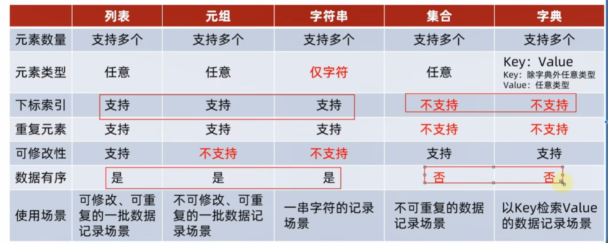

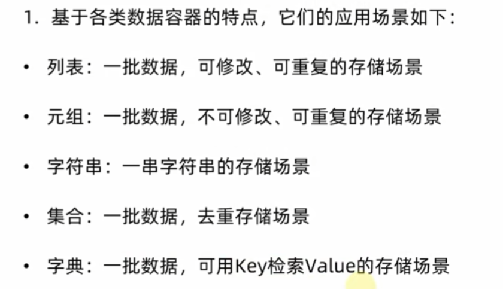

## 第七章 函数进阶

### 1. 函数的多返回值

### 2. 函数的多种传参方式

#### 1. 位置参数

#### 2. 关键字参数

使用“键 = 值”的方法，清楚了函数的位置。

#### 3. 缺省参数

默认参数，定义函数时为参数设定默认值。

且必须在最后。

#### 4. 不定长参数

##### 位置传递

元组 *args

##### 关键字传递

字典 **kwargs

### 3. 匿名函数

#### 将函数作为参数传入另一个函数：

计算逻辑的传递，而非数据的传递。

#### 匿名函数：

lambda

没有名称，只可临时使用一次

lambda只可写一行

使代码更简洁。

## 第八章 文件操作

### 1. 文件的编码

编码即翻译，让电脑能识别的二进制数翻译成人可识别的字符。

UTF-8 是目前全球通用的语言。

### 2. 文件的读取

打开、关闭、读、写

```python
open(name, mode, encoding)
# name - 打开文件的字符串，可以包含文件所在的具体路径
# mode - 打开文件的模式
# encoding - 编码
```

#### 1. 读操作

文件对象.read(num)

num表示要从文件中读取的数据的长度，如果没有传入num，那么就表示读取文件中所有的数据。


readlines()方法：

把整个文件的内容一次性读取，并且返回的是一个列表，其中每一行的数据为一个元素。


redaline()方法：

一次读取一行内容。

#### 2. 关闭

close()方法，

如果不调用close，那么被打开的文件将会被python一直占用。

#### 3. with open

with open() as f:

自动打开后关闭，

### 3. 文件的写入

write方法：

flush方法：只有经过flush或close，才能真正被写入硬盘。提高效率，降低硬盘的重复操作。

## 第九章 异常、模块与包

### 1. 异常

异常就是我们俗说的bug。

### 2. 异常的捕获

为什么要捕获异常：防止程序因为一个小bug而崩溃

```python
try：
	# 可能出错的代码
except：
	# 如果出现异常执行的代码
```

#### 1. 捕获指定异常

#### 2. 捕获全部异常

#### 3. else、finally

### 3. 异常的传递

### 4. 模块

头文化，一个python文件，里面有类、函数、变量等。

#### 1. 模块的导入


```python
[from 模块名] import [模块|类|变量|函数|*] [as 别名]
```

#### 2. 自定义模块

### 5. 包

python的包就是一个具有多个模块文件的文件夹。

#### 1. 自定义包

#### 2. 安装第三方包

## 第十章 基础综合案例 图表

### 案例一

#### 1. json

一种轻量级数据交互模式，用于在不同的计算机语言中传递数据。带有特定格式的字符串。

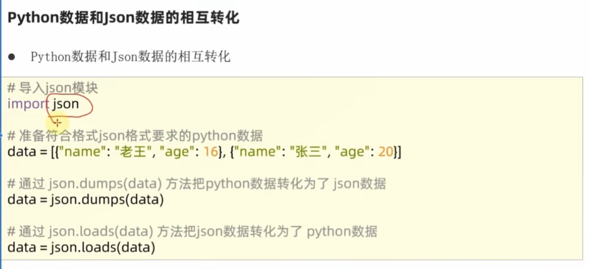

#### 2. pyecharts模块