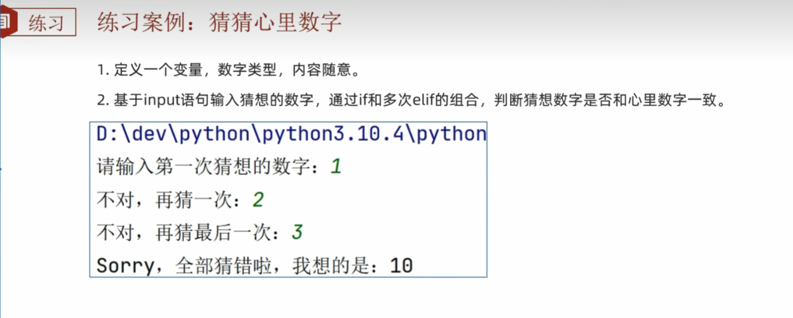
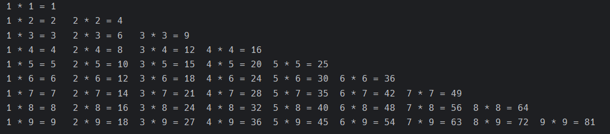
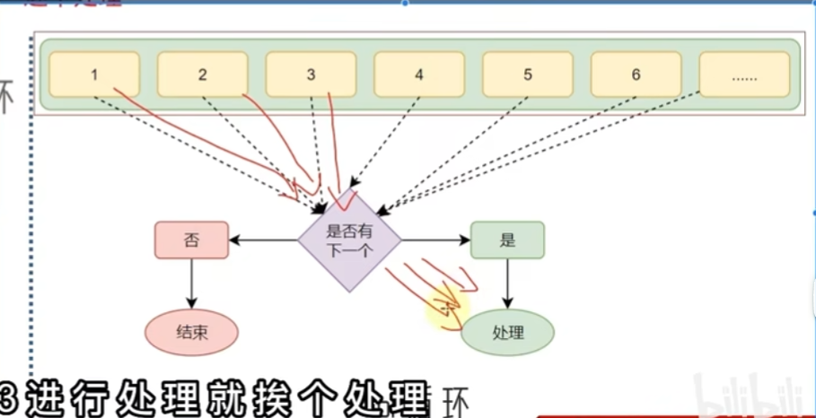
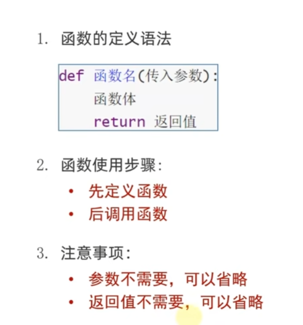
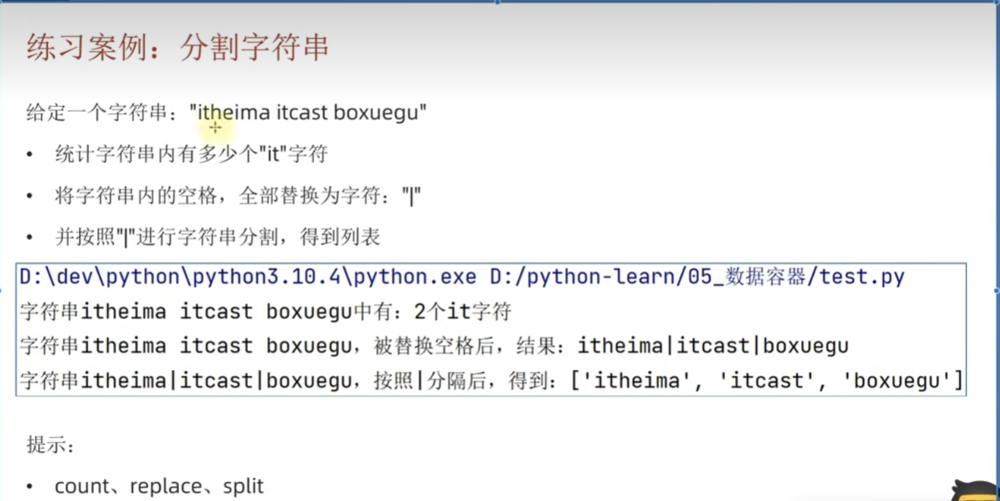
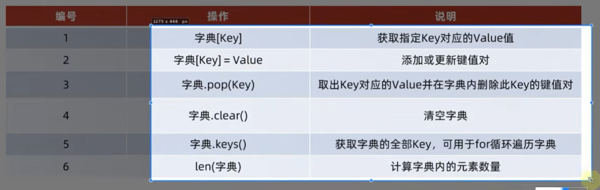

# python初学者笔记

## 第一章节 你好，python

### 1.初识python

#### 1.起源

起源于一个圣诞节假期

#### 2.为什么选择python

优雅：

1. 简单
2. 易学
3. 开发效率高

适用面广泛：

1. 人工智能
2. 大数据

### 2.什么是编程语言

语言：进行沟通交流的语言

编程语言：与计算机进行交流的语言

### 3.python安装

### 4.第一个python程序

print("hallo world!")

### 5.python解释器

### 6.python开发环境

关于 Pycharm

## 第二章节 Python基本语法

### 1. 字面量

字面量：在代码中，**被写下来**的值，称之为字面量。

**常用的值类型：**

* 数字 - int, float, complex, bool
* 字符串 - string
* 列表 - list - 有序的可变序列
* 元组 - tuple - 有序的不可变序列
* 集合 - set - 无序不重复集合
* 字典 - dictionary - 无序 Key-Value 集合

### 2. 注释

注释：在程序代码中对程序代码进行解释说明。

作用：注释不是程序，**不能被执行**，只是对程序代码进行解释说明，让别人可以看懂程序代码的作用，能够大大增强程序可读性。

例子：

```python
## 这是一个注释示例
```

### 3. 变量

变量：在**程序运行时**，能储存计算结果或能表示值的抽象概念。

简单的说，变量就是在程序运行时，记录数据用的。

变量的**内容可以发生改变**。

**变量的定义格式：**

```python
变量名称 = 变量的值

# 例子
money = 100
```

### 4. 数据类型

主要的三种数据类型：

|类型|描述|说明|
| --------| ------------------| ------------------------------|
|string|字符串类型|用引号引起来的数据都是字符串|
|int|整形（有符号）|数字类型，存放整数|
|float|浮点型（有符号）|数字类型，存放小数|

验证数据类型：type( data )

在python中，变量是无类型的，而变量存储的数据是有类型的。

### 5. 数据类型转换

为什么要转换：

1. 从文件读取出的数字，默认是字符串，转换为数字类型。
2. input( )输入的结果默认是字符串，若需要数字必须进行转换。
3. 将数字转换为字符串输出。
4. 等等。

|语句（函数）|说明|
| --------------| --------------|
|int(x)|转换为整数|
|float(x)|转换为浮点数|
|str(x)|转换为字符串|

### 6. 标识符

标识符：用来做内容的标记；

* 变量的名字
* 方法的名字
* 类的名字
* 等等

#### 内容限定：

标识符只允许出现：

* 英文
* 中文（不推荐）
* 数字（不可以用在开头）
* 下划线 _

**大小写敏感：**

大小写是不同的。

**不可使用关键字：**

### 7. 运算符

|运算符|描述|
| --------| --------|
|+|加|
|-|减|
|*|乘|
|/|除|
|//|取整数|
|%|取余|
|**|指数|

### 8. 字符串扩展

```python
name_a = 'python'# 单引号定义法
name_b = "python"# 双引号定义法
name_c = """p
			y
			t
			h
			o
			n"""	# 三引号定义法
```

**三引号定义法，和多行注释的写法一样，同样支持换行操作。使用变量取接受时，它就是字符串，不使用变量去接收时，它就可以作为多行注释使用。**

转义字符 \ 来解除引号的效用。

#### 字符串的拼接：无法和非字符串类型进行拼接

```python
name = Cristy
print("my name is" + name)

# 输出：my name is Cristy
```

#### 字符串格式化：%s %d %f

```python
name = Cristy
cash = 1314
message = "%s %s" % (name, cash)
```

**格式化的精读控制：”m.n&quot;**

m：控制宽度，要求是数字，设置的宽度要大于数字本身，否则不生效

.n：控制小数点的精读，会进行小数的四舍五入

```python
float_a = 1.554
print("%.2f" % float_a)
# 输出 1.55
```

#### 字符串格式化方式2：快速格式化

f"内容{变量}"来快速格式化，不做精度控制，不限类型 -> f = formot

```python
cash = 54
name = "CristY"
print(f"my name is {name}, and my cash is {cash}")
# output：my name is CristY, and my cash is 54.78
```

#### 对表达式进行格式化

表达式：一条具有明确执行结果的代码语句。

```python
print("1 * 1 = %d" % (1 * 1))
print(f"2 * 1 = {2 * 1}")
# output： 1 * 1 = 1
# 2 * 1 = 2
```

### 练习

​

```python
name = "传智播客"
stock_price = 19.99
stock_code = "003032"
stock_price_rise_num = 1.2
days = 7
final_price = stock_price * (stock_price_rise_num ** days)
print(f"公司：{name},股票代码：{stock_code},当前股价：{stock_price}")
print("每日增长系数 %.1f, 经过%d天增长，股价最终为:%.2f" % (stock_price_rise_num, days, final_price))
# output:
# 公司：传智播客,股票代码：003032,当前股价：19.99
# 每日增长系数 1.2, 经过7天增长，股价最终为:71.63
```

### 9. 数据输入

input:

```python
print("请输入一个整数：")
num1 = input()
num2 = int(num1) * 10
print(num2)

num1 = input("请输入一个整数：")
```

## 第三章 判断语句

### 1. 布尔类型和比较运算符

#### 布尔类型

是(True)或否(False)

#### 比较运算符

|运算符|描述|
| --------| --------------------|
|==|判断内容是否相等|
|!=|判断内容是否不相等|
|>|大于|
|<|小于|
|>=|大于等于|
|<=|小于等于|

### 2. if语句基本格式

```python
age = input()
age = int(age)
if age >= 18:
    print("小美成年了")
    print("时间过得好快啊！")

print("哈哈。。。")
```

if 内容 比较运算符 条件 **:**
	(while if == true run)
(run)

#### 练习题

​

```python
print("欢迎来到黑马儿童游乐场，儿童免费，成人收费。")
age = input("请输入你的年龄：")
age = int(age)
price = 10
if age >= 18:
    print("您已成年，游玩需要补票%d元！" % price)

print("祝您游玩愉快！")
```

### 3. if else:

​

```python
print("欢迎来到黑马儿童游乐场，儿童免费，成人收费。")
age = input("请输入你的年龄：")
age = int(age)
price = 10
# 
if age >= 18:
    print("您已成年，游玩需要补票%d元！" % price)
else:
    print("小朋友好！")
# 
print("祝您游玩愉快！")
```

#### 练习题

​

```python
print("欢迎来到黑马动物园。")
high = input("请输入你的身高（cm）：")
high = int(high)
if high > 120:
    print("您的身高超出120cm，游玩需要购票10元。")
else:
    print("您的身高未超过120cm，可以免费游玩。")

print("祝您游玩愉快。")
```

### 4. if elif else:

​

#### 练习

​

```python
num = input("请输入第一次想猜的数字：")
right_num = 10
num = int(num)
if num == right_num:
    print("恭喜你，猜对了！")
elif num != right_num:
    num = input("猜错了，请再猜一次：")
    num = int(num)
    if num == right_num:
        print("恭喜你，猜对了！")
    else:
        print(f"Sorry，全猜错了，我想的是：{right_num}")
```

### 5. 判断语句的嵌套：

关键在于 tab 缩进。

### 6. 综合案例：

```python
import random
num = random.randint(1, 10)

num1 = input("你有三次机会，请输入第一次想猜的数字：")
num1 = int(num1)
if num1 == num:
    print(f"恭喜你，猜对了，数字是{num}")

else:
    if num1 > num:
        print("bigger")
    else:
        print("smaller")

    num1 = input("你有三次机会，请输入第二次想猜的数字：")
    num1 = int(num1)
    if num1 == num:
        print(f"恭喜你，猜对了，数字是{num}")

    else:
        if num1 > num:
            print("bigger")
        else:
            print("smaller")

        num1 = input("你有三次机会，请输入第三次想猜的数字：")
        num1 = int(num1)
        if num1 == num:
            print(f"恭喜你，猜对了，数字是{num}")
        else:
            print("Sorry, all Wrong!")
            print(num)
```

## 第四章 循环语句

### 1. while：

```python
i = 1
while i <= 10:
    print(i)
    i = i + 1
print(i)
```

​

```python
i = 1
num = 0
while i <= 100:
    num = num + i
    i = i + 1
print(num)
```

​

```python
i = 1
j = 1

while i < 10:
    while j < i:
        print(f"{j} * {i} = {i * j}\t", end='')
        j += 1
    print(f"{j} * {i} = {i * j}")
    i += 1
    j = 1
```

​

### 2. for：（与 c语言 不同）

for 循环是一种**轮询**机制。




​​


```python
name = "itheiman is a brand of itcast"
count = 0
for x in name:
    if x == "a":
        count += 1
      
print(count)
```

#### range 语句：

所谓的“待处理数据集”，严格来说，应该叫做：序列类型

> 序列类型：其内容可以一个个依次取出的一种类型，包括：
>
> * 字符串
> * 列表
> * 元组
> * 等

​

#### 综合案例

​

```python
for i in range(1, 10):
    for j in range(1, i + 1):
        if i != j:
            print(f"{j} * {i} = {i * j}\t", end='')
        else:
            print(f"{j} * {i} = {i * j}")
```

### 3. 循环中断：break continue

continue：跳过循环下面的步骤，**重新开始**循环。

break：**中断**整个循环。

## 第五章 函数

### 1. 什么是函数：

函数是**组织好**的，**可重复使用**的，用来实现特定功能的**代码段**。

```python
def my_lan(data):
    cont = 0
    for i in data:
        cont += 1
    print(cont)

my_lan("Cqupt")
# output：5
```

​

### 2. 函数的参数

函数传入参数的数量不受限制。

#### 几个特殊的命名

* 单前导下划线：`_var`
* 双前导下划线：`__var`
* 单末尾下划线：`var_`
* 双前导和末尾下划线：`__var__`
* 单下划线：`_`

​

### 3. 函数的返回值

return 返回值

#### None类型

### 4. 函数说明文档

### 5. 函数的嵌套调用

### 6. 函数的作用域

局部变量和全局变量

global 声明全局变量

## 第六章 数据容器

### 1. 什么是数据容器

一种可以容纳多份数据的数据类型，容纳的每一份数据称之为1个元素。

每一个元素，可以是任意类型的数据，如字符串、数字、布尔。

被分为五类：列表、元组、字符串、集合、字典

### 2. list 列表

#### 1. 定义

```python
x = [, , , ,]
```

#### 2. 下标索引

正向、反向、列表嵌套索引

#### 3. 常用操作（列表的方法）

* ##### 查找某元素下标

> resalut = my_list.index("查找内容")

* ##### 修改下标索引内容

> my_list[0] = 5

* ##### 插入元素

> my_list.insert(1, "插入内容")

* ##### 追加元素

1. 单个

> my_list.append("元素")

2. 多个

> my_list.extend([])

* ##### 删除元素

1. del 列表[下标]
2. 列表.pop(下标) - 可以把删掉的元素作为返回值
3. 列表.remove(元素)

* ##### 清空列表

列表.clear()

* ##### 统计某元素在列表中的数量

列表.count(元素)

* ##### 统计列表中全部的元素数量

len(列表)


#### 4. 列表的特点

* 可以容纳多个元素
* 可以容纳不同类型的元素（混装）
* 数据是有序存储的（有下标符号）
* 允许重复数据存在
* 可以修改（增加或删除元素）

### 3. 列表的遍历

类似于c，用循环结构对列表进行遍历

### 4. 元组

元组同列表类似，但元组一旦定义完成，就不可被修改。

```python
x = ( , , , , )
y = (54, )
```

#### 1. 元组的操作


### 5. 字符串

同元组一样，字符串是一个无法修改的数据容器。

#### 1. index

#### 2. replace

替换的是字符串全部内容。

#### 3. split

分隔，将字符串划分为多个字符串，并存入列表对象中。

#### 4. 字符串规整

​

#### 5. count、len

​

​

```python
p = "itheima itcast boxuegu"
num_1 = p.count("it")
print(num_1)
p_1 = p.replace(" ", "|")
print(p)
p_1 = p_1.split("|")
print(p_1)
```

### 6. 序列

序列：内容连续、有序、可使用下标索引的一类数据容器。

列表、元组、字符串都可视为序列。

#### 1. 切片

> list = list_old[::]

### 7. 集合

集合，不能有相同元素，并且内部无序。

#### 1. 修改方法


### 8. 字典

一对一的查找，key: value

通过key来取到value。

key不能是字典。

#### 1. 常用操作



```python
name = {
    '王力宏': {'部门': '科技部', '工资': 3000, '级别': 1},
    '周杰伦': {'部门': '市场部', '工资': 5000, '级别': 2},
    '林俊杰': {'部门': '市场部', '工资': 7000, '级别': 3},
    '张学友': {'部门': '科技部', '工资': 4000, '级别': 1},
    '刘德华': {'部门': '市场部', '工资': 6000, '级别': 2}
}
print(f"全体员工当前信息如下，\n{name}")
for name_key in name:
    if name[name_key]['级别'] == 1:
        name[name_key]['级别'] += 1
        name[name_key]['工资'] += 1000

print(f"全体级别为1的员工完成升职加薪操作，操作后，当前信息如下，\n{name}")
```

### 9. 总结


## 第七章 函数进阶

### 1. 函数的多返回值

### 2. 函数的多种传参方式

#### 1. 位置参数

#### 2. 关键字参数

使用“键 = 值”的方法，清楚了函数的位置。

#### 3. 缺省参数

默认参数，定义函数时为参数设定默认值。

且必须在最后。

#### 4. 不定长参数

##### 位置传递

元组 *args

##### 关键字传递

字典 **kwargs

### 3. 匿名函数

#### 将函数作为参数传入另一个函数：

计算逻辑的传递，而非数据的传递。

#### 匿名函数：

lambda

没有名称，只可临时使用一次

lambda只可写一行

使代码更简洁。

## 第八章 文件操作

### 1. 文件的编码

编码即翻译，让电脑能识别的二进制数翻译成人可识别的字符。

UTF-8 是目前全球通用的语言。

### 2. 文件的读取

打开、关闭、读、写

```python
open(name, mode, encoding)
# name - 打开文件的字符串，可以包含文件所在的具体路径
# mode - 打开文件的模式
# encoding - 编码
```

#### 1. 读操作

文件对象.read(num)

num表示要从文件中读取的数据的长度，如果没有传入num，那么就表示读取文件中所有的数据。

‍

readlines()方法：

把整个文件的内容一次性读取，并且返回的是一个列表，其中每一行的数据为一个元素。

‍

redaline()方法：

一次读取一行内容。

#### 2. 关闭

close()方法，

如果不调用close，那么被打开的文件将会被python一直占用。

#### 3. with open

with open() as f:

自动打开后关闭，

### 3. 文件的写入

write方法：

flush方法：只有经过flush或close，才能真正被写入硬盘。提高效率，降低硬盘的重复操作。

## 第九章 异常、模块与包

### 1. 异常

异常就是我们俗说的bug。

### 2. 异常的捕获

为什么要捕获异常：防止程序因为一个小bug而崩溃

```python
try：
	# 可能出错的代码
except：
	# 如果出现异常执行的代码
```

#### 1. 捕获指定异常

#### 2. 捕获全部异常

#### 3. else、finally

### 3. 异常的传递

### 4. 模块

头文化，一个python文件，里面有类、函数、变量等。

#### 1. 模块的导入

‍

```python
[from 模块名] import [模块|类|变量|函数|*] [as 别名]
```

#### 2. 自定义模块

### 5. 包

python的包就是一个具有多个模块文件的文件夹。

#### 1. 自定义包

#### 2. 安装第三方包

## 第十章 基础综合案例 图表

### 案例一

#### 1. json

一种轻量级数据交互模式，用于在不同的计算机语言中传递数据。带有特定格式的字符串。


#### 2. pyecharts模块

‍
