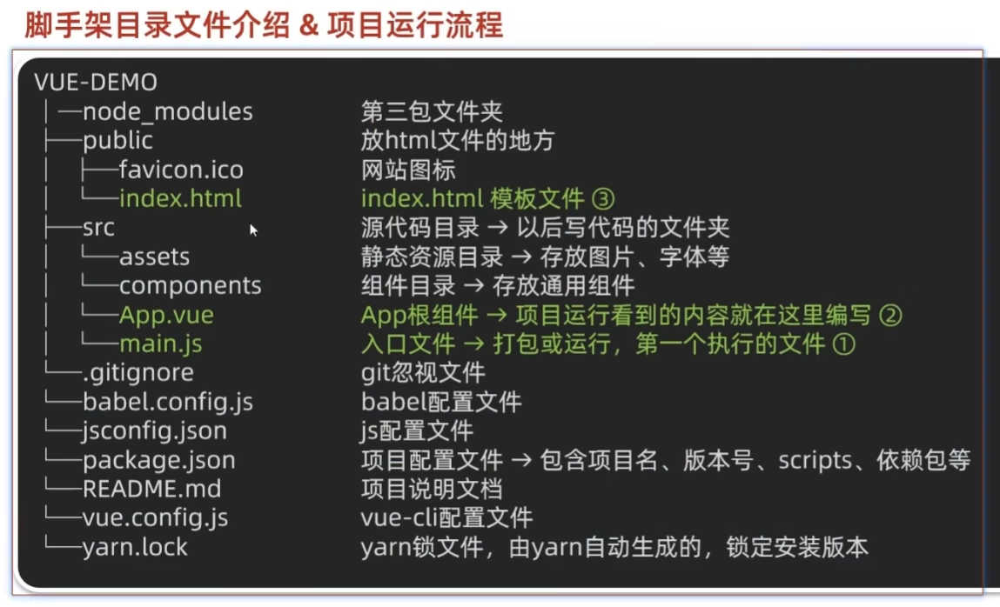

# Vue2 + Vue3

## Day1

### Vue快速上手

#### 什么是 Vue

Vue.js 是一套用于**构建用户界面（基于数据渲染出用户看到的画面）**的**渐进式（循序渐进）**框架。

1. 基于核心包进行局部开发
2. 工程化开发进行整站开发

优点：大大提升开发效率

缺点：需要记忆语法规则

#### 创建Vue实例

构建用户界面 <- 创建Vue实例

1. 准备容器
2. 引包
3. 创建Vue实例
4. 制定配置项

#### 插值表达式

插值表达式是一种 Vue 的模板语法

1. 作用：利用表达式进行插值，渲染到页面中。
2. 语法：{{ Js表达式 }}
3. 注意点：
   1. 所使用的数据必须存在
   2. 支持的是表达式，而非语句（或关键字）
   3. 不能再标签属性中进行插值

#### 响应式特性

响应式：数据变化，页面自动更新

#### 开发者工具

### Vue指令

Vue 会根据不同的指令，针对标签实现不同的功能

指令：带有 v- 前缀的属性，不同的属性对应不同的功能

#### v-show v-if

v-show：控制标签的显示与隐藏

v-show="表达式"，表达式值为true时显示，为false时隐藏，但是会保留标签

v-show，实际上是添加了display: none

用于频繁切换显示隐藏的场景

---

v-if：控制标签的显示与隐藏（条件渲染）

v-if="表达式"，表达式值为true时显示，为false时隐藏

用于不频繁切换的场景

#### v-else v-else-if

辅助v-if指令，用于条件渲染

使用时需要紧接着v-if指令

#### v-on

注册事件 = 添加监听 + 提供处理逻辑

语法：

v-on:"事件名" = "内联语句"

v-on:"事件名" = "methods中的函数名"

简写：

可以将`v-on:`替换为`@`

methods函数中的this，指向Vue实例

#### v-on 调用传参

#### v-bind

作用：动态设置html标签的属性

语法：v-bind:属性名="表达式"

当表达式为true时，属性名会生效，为false时，属性名不会生效

简写：v-bind="表达式" --> :属性名="表达式"

#### v-for

作用：基于数据进行循环，多次渲染整个元素

语法：v-for="(item, index) in 数组"

item - 数组中的元素

index - 数组中的索引

#### v-for 中的 key

语法：v-for="(item, index) in 数组" :key="唯一标识"

作用：给列表项添加的唯一标识，便于Vue进行列表项的正确排序复用

注意点：

1. key的值只能是 字符串 或者 数字类型
2. key的值必须唯一
3. 推荐使用 id 作为 key 的值，不推荐使用 index 作为 key 的值

#### v-model

作用：给**表单**元素使用，双向数据绑定 -> 可以快速获取或设置表单内容

数据变化 - 视图更新

视图更新 - 数据变化

语法：v-model="变量名"

## Day2

### 指令补充

#### 指令修饰符

不同的修饰符后缀封装了不同的操作 - 简化代码

##### 1. 按键修饰符

@keyup.enter - 键盘回车监听

##### 2. v-model修饰符

v-model.trim - 去除首位空格

v-model.number - 转数字

##### 3. 事件修饰符

@事件名.stop - 阻止冒泡

@事件名.prevent - 阻止默认事件

### v-bind 对于样式控制的增强

Vue 扩展了v-bind指令，可以控制样式

#### 操控class

语法：`:class="对象/数组"`

`:class="{active: true}"`

适用：一个场景，来回切换

`:class="['active', 'text']"`

适用：批量添加或删除类

#### 操控style

语法：`:style="对象"`

`:style="{color: 'red', fontSize: '14px'}"`

适用：某个具体属性的动态控制

### v-model 运用于其他表单元素

常见的表单元素都可以用 v-model 进行双向数据绑定

它会根据 **控件类型** 自动选取 正确的方法来 更新元素

- input:text - value
- textarea - value
- input:checkBox - checked
- input:radio - checked
- select - value

### 计算属性

基于现有数据，计算出的数据

依赖的数据发生变化，计算属性也会重新计算

语法：

- 声明在 computed 配置项中，一个计算属性对应一个函数
- 使用时和普通属性一样，直接使用即可

### computed 与 methods 的区别

#### computed

作用：封装了一段对数据的处理，求得一个结果

语法：

1. 写在 computed 配置项中
2. 作为属性，直接使用

**缓存特性**：计算属性会缓存，再次使用时读取缓存即可，但是依赖的数据发生变化时，会重新计算

#### methods

作用：给实例提供一个方法，调用以处理业务逻辑

语法：

1. 写在 methods 配置项中
2. 作为方法，需要调用

### 计算属性完整写法

计算属性默认的简写，只能读取访问，不能进行修改

如果需要进行修改，需要写计算属性的完整写法

```javascript
computed: {

   funCtion_1: {
     get() {
      pass
      return
     },
     set(value) {
      pass
     }
   }  
}
```

### watch 监听器

作用：监听数据变化，进行响应式处理，执行一些业务逻辑或者异步操作

语法：

1. 简单写法 -> 简单类型数据，直接监视
2. 复杂写法 -> 添加额外配置项

#### 简单写法

```javascript
watch: {
   'obj.words'(newValue) {
      clearTimeout(this.timer)
      this.timer = setTimeout(async () => {
         const res = await axios({
            url: '/api/search',
            params: {
               words: newValue
            }
         })
         this.result = res.data.data
      }, 300)
   }
}
```

#### 完整写法

监视对象的所有属性

```javascript
watch: {
   obj: {
      deep: true,
      handler(newValue) {

      }
   }
}
```

添加deep配置项，监视对象中所有属性的变化

添加immediate配置项，进入页面立即执行一次监听器

## Day3

### 生命周期

#### 生命周期以及生命周期的四个阶段

1. 什么时候发出初始化渲染请求？
2. 什么时候开始操作DOM？

Vue生命周期：即一个Vue实例从创建到销毁的过程

new Vue() - 创建 - 挂载 - 更新 - 销毁

new Vue() - 响应式数据 - 渲染模板 - 数据修改，更新视图 - 销毁实例

#### 生命周期钩子函数

Vue生命周期过程中，会自动运行一些函数，被称为生命周期钩子函数，让开发者可以在特定阶段运行自己的代码

**created**（发送初始化请求） - **mounted**（操作DOM） - updated - destroyed

### 工程化开发和脚手架 Vue CLI

#### 开发Vue的两种方式

1. 通过 script 标签引入 Vue 运行时库，然后通过 Vue.createApp() 创建 Vue 实例
2. 工程化开发模式：基于构建工具的环境进行开发

源代码 -> 自动化 -> 运行的代码

#### 使用脚手架的方法

- 开箱即用
- 内置babel工具

1. npm i @vue/cli -g
2. vue --version
3. vue create 项目名
4. npm run serve



#### 脚手架文件系统

文件夹：

- node_modules：依赖包
- public：静态资源
- src：源代码

重要文件：

- public/index.html：入口文件
- src/App.vue：根组件
- sec/main.js：核心入口文件 - 导入 App.vue，基于 App.vue 创建 index

### 组件化开发和根开发

1. 组件化：每一个app都被拆分为一个个组件，每个组件都有自己的结构、逻辑、样式；利于维护、复用。
2. 根组件：整个应用最上层的组件，包裹有整个应用的所有组件

#### 单文件组件的三个组成部分

1. template 结构：有且只能由一个根元素
2. script 行为：js逻辑
3. style 样式：可支持less，需要装包

#### 普通组件注册使用-局部注册

局部注册：只能在注册的组件内使用

1. 创建 .vue 文件
2. 在使用的组件内导入并注册

#### 全局注册

全局注册：可以在所有组件范围内都可以使用

1. 创建 .vue 文件
2. 在 main.js 中注册

## Day4

### 组件的三大组成部分

#### 结构 template

#### 样式 style

#### 逻辑 script

#### scoped样式冲突/data是一个函数

在默认情况下，写在组件内部的样式会 全局生效 - 因此很容易造成多个组件之间的样式冲突

解决：

使用 scoped 样式，解决样式冲突

原理：

1. 给当前组件模板的所有元素，都会被添加上一个自定义唯一属性
2. css选择器中，添加这个自定义属性，即可实现样式隔离

一个组件的data选项必须是一个函数 - 保证每一个组件单独实例化，维护独立的一份数据对象

### 组件通信

组件通信，就是组件与组件之间的数据传递

- 组件的数据是相互独立的，无法直接访问其他组件的数据
- 如果要使用其他组件的数据，需要通过组件通信

#### 组件关系

1. 父子组件 - 直接包裹 - props 和 $emit
2. 非父子组件 - 非关联 - provide 和 inject 以及 eventbus
3. 通用解决方案 - 使用 Vuex

#### 父子通信

1. 父组件通过 props 传递数据给子组件
2. 子组件利用 $emit 通知父组件修改更新

##### 什么是 prop

prop 是组件上注册的一些自定义属性

作用：向子组件传递数据，可以传递任意数量和任意类型

##### props 校验

为 props 添加校验规则，可以保证数据的安全性，在数据类型出错的时候，会自动抛出异常

语法：

- 类型检验

```javascript
props: {
   校验的属性：类型
},
```

- 详细检验

```javascript
props: {
   校验的属性: {
      type: 类型,
      required: true
      default: 默认值
      validator(value) {
         // 自定义校验逻辑
         return 是否通过校验
      }
   }
},
```

##### prop 和 data、单向数据流

共同点：都可以给组件提供数据。

data 的数据是**自己**的，可以随便改

prop 的数据是**父组件**的，不能直接改，需要遵循**单向数据流**

单向数据流：父组件的 prop 数据只能是单向的，不能被子组件修改，子组件只能通过 $emit 通知父组件修改更新

谁的数据谁负责

#### 非父子通信 - event bus 数据总线

作用：非父子组件之间的简易消息传递，复杂场景需使用 Vuex

1. 创建一个都能访问到的事件总线（空Vue实例）-> utils/EventBus.js
2. A组件（接收方），监听 Bus 实例的事件
3. B组件（发送方），触发 Bus 实例的事件

发布的通知是一对多的关系

#### 非父子通信拓展 - provide/inject

provide/inject：可以实现跨层级共享数据

1. 父组件 provide 提供数据
2. 子\孙组件 inject 接收数据

简单类型的传递不是响应式的，复杂类型的传递是响应式的

### v-model 原理

v-model：本质上是语法糖，是 v-bind 和 v-on 的结合

>语法糖：语法的简写

#### 表单类组件封装 以及 v-model 简化代码

##### 表单类组件 - 封装

1. 父传子：数据应该是从父组件 props 传递而来，v-model 拆解 绑定数据
2. 子传父：监听事件，子传父传值给父组件进行修改

##### 父组件 v-model 简化代码，实现 子组件 与 父组件 双向绑定

1. 子组件中：props 通过 value 接收，事件触发 input
2. 父组件中：v-model 给组件绑定数据

#### .sync 修饰符

作用：可以实现 子组件 和 父组件数据 的双向绑定

特定：prop 属性名，可以自定义，非固定为 value

场景：封装弹框类的基础组件，visible属性

本质：就是 :属性名 和 @update:属性名 的合写

### ref 和 $ref

作用：利用 ref 和 $ref 可以用于获取dom元素，或 组件实例

特点：查找范围 -> 当前组件内 （更精确地获取）

1. 获取dom：
   1. 目标标签 - 添加 ref 属性
   2. 恰当时机，通过this.$refs.{ref属性名}获取目标标签
2. 获取组件实例：
   1. 目标组件 - 添加 ref 属性
   2. 恰当时机，通过this.$refs.{ref属性名}获取目标组件实例  

### Vue异步更新，$nextTick

Vue是异步更新DOM的，当数据发生改变时，DOM不会立刻更新，而是会进行缓冲，当缓冲时间期限结束，才会更新DOM。

$nextTick：等DOM更新后，才会触发执行此方法里的函数体

语法：this.$nextTick(() => {函数体})

## Day5

### 自定义指令

内置指令：v-model、v-html、v-text、v-show、v-if、v-for

同时，可以进行自定义指令

即封装一些DOM操作，以扩展额外的功能

#### 全局注册指令

在 main.js 中进行全局注册

```javascript
Vue.directive('指令名', {
   "inserted": function(el, binding) {
      el.focus()
   }
})
```

#### 局部注册指令

在组件中进行局部注册

```javascript
directives: {
   "指令名": {
      inserted: function(el, binding) {
         el.focus()
      }
   }
}
```

#### 指令使用

```html
<input type="text" v-指令名>
```

#### 自定义指令 - 指令的值

指令可以传值

- 在绑定指令时，通过等号对指令进行传值
- 根据 binding.value 获取指令的值，指令值修改时会触发 update 钩子函数

### 插槽 - 默认插槽

作用：让组件内部的一些**结构**支持自定义

场景：希望封装一个组件来节省代码，但是同时想要组件内部的参数发生改变

#### 插槽 - 基本语法

1. 组件内部需要定制的结构部分，改用`<slot></slot>`进行占位
2. 使用组件时，`<myDialog>插槽内容</myDialog>`进行替换

#### 插槽 - 后备内容（默认值）

如果插槽里面没有内容，则使用后备内容（默认值）

插槽后背内容：封装组件时，可以为预留的`<slot>`插槽提供后备内容

在创建插槽时，在`<slot>`标签内添加内容，即可完成默认值的设置

#### 具名插槽

需求：一个组件内有多处结构，需要进行定制

默认插槽只能由一个结构进行定制

1. 多个slot使用name属性进行区分
2. template使用时，配合v-slot，使用名字分发插槽
3. v-slot:插槽名 简化为 #插槽名

创建具名插槽：

```javascript
// 具名插槽 - 作用域插槽
<template>
   <div class="dialog-header">
      <slot name="header"></slot>
      <slot name="body"></slot>
      <slot name="footer"></slot>
   </div>
</template>
```

使用：

```javascript
<Mydialog>
  <template v-slot:header>
   <div>自定义内容<div>
  </template>
</Mydialog>
```

#### 插槽 - 作用域插槽

定义：定义slot插槽的时候，是可以传值的。在插槽上可以绑定数据，将来使用组件时可以进行使用

1. 给slot标签，以添加属性的方式进行传值
2. 所有添加的属性，都会被传入一个对象当中
3. 在template中，通过`#插槽名="obj"`的方式接收，默认插槽名为default

### 单页应用程序

单元应用程序：SPA - Signle Page Application

即，所有功能在**一个**html页面上完成


- 单页：系统类网址/内部网站/文档类网站/移动端网站 - 关注性能
- 多页：公司官网/电商类网站 - 考虑首屏加载速度

#### 路由

一一对应的映射关系

生活中的路由：设备与ip的映射关系

Vue中的路由：路径与组件的映射关系

#### VueRouter

作用：修改地址栏路由时，切换显示匹配的组件

说明：是Vue官方的一个插件，是一个第三方包

官网：[https://v3.router.vuejs.org/zh](https://v3.router.vuejs.org/zh)

##### VueRouter的使用（5 + 2）

5个常用步骤：

1. 下载：VueRouter模块当工程中。2（Vue2）33(Vuerouter3.x/Vuex3.x)、3（Vue3）44
2. 引入
3. 安装注册
4. 创建路由对象
5. 注入，将路由对象注入到new Vue实例中，建立关联

2个关键步骤：

1. 创建需要的组件，配置路由规则
2. 配置导航，配置路由出口（路径匹配的组件显示的位置）

##### 组件分类

组件分类：.vue文件分为 页面组件和复用组件

- 将页面组件放在 src/views下

- 将复用组件放在 src/components下
