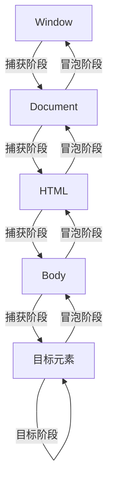
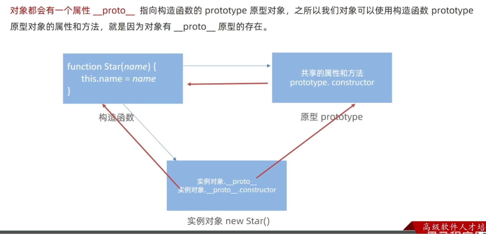

## Day1

### 1、JS简介

#### 1. JS是什么：

是一种运行在**客户端（客户端）** 的编程语言，实现**人机互动**。

#### 2. 作用：

* 网页特效。
* 表单验证。
* 数据交互。

#### 3. 组成：

ECMAScript、web APIs（DOM、BOM）

### 2、JS书写位置

#### 1. 内部JS

直接写在HTML文件里，用script标签包住。

script要写在</body\>上面（写在下面保证加载）

#### 2. 外部JS

代码写在 .js 文件里

在script标签中引用

#### 3. 内联JS

### 3、注释和结束符

* 单行注释，//
* 块注释，/* */

结束符为分号，可以省略

### 4、输入输出语法

#### 1. 输出语法：

```javascript
document.write('')
/*
   作用：向body内输出内容
   注意：如果输出的内容写的是标签，也会被解析成网页元素
*/
alert('') // 页面弹出
console.log('') // 控制台渲染
```

#### 2. 输入语法：

```javascript
prompt('')
```

alert 和 prompt会先被渲染

### 5、字面量

#### 1. 变量

变量是一个存储数据的容器。

`let`

* **作用域**：块级作用域（block-scoped）。
* **提升**：变量声明会被提升，但不会初始化，存在暂时性死区（TDZ）。
* **重复声明**：不允许重复声明。

```javascript
let y = 10;
if (true) {
    let y = 20; // 不同的变量
}
console.log(y); // 输出 10
```

#### 2. 常量

在 JavaScript 中，常量是指值不能被重新赋值的变量。使用 `const` 关键字可以声明常量。常量的值在声明时必须初始化，并且在后续代码中不能被修改。

---

##### **声明常量的语法**

```javascript
const CONSTANT_NAME = value;
```

* `CONSTANT_NAME`：常量的名称，通常使用全大写字母和下划线分隔单词（如 `MAX_USERS`）。
* `value`：常量的初始值，必须在声明时赋值。

---

##### **常量的特点**

1. **不可重新赋值**：

    * 使用 `const` 声明的常量不能被重新赋值。
    * 如果尝试重新赋值，会抛出错误。

    ```javascript
    const PI = 3.14159;
    // PI = 3.14; // 报错：Assignment to constant variable.
    ```
2. **块级作用域**：

    * `const` 声明的常量是块级作用域（block-scoped），只能在声明它的块（如 `{}`）内访问。

    ```javascript
    if (true) {
        const MAX_USERS = 100;
        console.log(MAX_USERS); // 输出 100
    }
    // console.log(MAX_USERS); // 报错：MAX_USERS 未定义
    ```
3. **声明时必须初始化**：

    * `const` 声明的常量必须在声明时赋值，否则会报错。

    ```javascript
    // const MAX_USERS; // 报错：Missing initializer in const declaration
    const MAX_USERS = 100; // 正确
    ```
4. **对象和数组的内容可以修改**：

    * `const` 只保证变量名绑定的内存地址不变，但对于对象或数组，其内容可以修改。

    ```javascript
    const user = { name: "Alice" };
    user.name = "Bob"; // 允许修改对象属性
    console.log(user); // 输出 { name: "Bob" }

    const numbers = [1, 2, 3];
    numbers.push(4); // 允许修改数组
    console.log(numbers); // 输出 [1, 2, 3, 4]
    ```

---

##### **常量的命名规范**

* 常量名通常使用全大写字母，并用下划线（`_`）分隔单词。
* 这种命名方式有助于区分常量和普通变量。

```javascript
const MAX_USERS = 100;
const API_KEY = "12345";
const DEFAULT_TIMEOUT = 5000;
```

---

##### **常量 vs 变量**

* **常量（****`const`** **）** ：

  * 值不能被重新赋值。
  * 必须在声明时初始化。
  * 适用于不会改变的值（如配置、数学常数等）。
* **变量（****`let`** **）** ：

  * 值可以被重新赋值。
  * 可以在声明后初始化。
  * 适用于可能改变的值。

---

##### **示例代码**

```javascript
// 声明常量
const PI = 3.14159;
const MAX_USERS = 100;
const API_KEY = "12345";

// 常量对象
const user = {
    name: "Alice",
    age: 25
};
user.age = 26; // 允许修改对象属性
console.log(user); // 输出 { name: "Alice", age: 26 }

// 常量数组
const colors = ["red", "green", "blue"];
colors.push("yellow"); // 允许修改数组
console.log(colors); // 输出 ["red", "green", "blue", "yellow"]

// 尝试重新赋值常量（会报错）
// PI = 3.14; // 报错：Assignment to constant variable.
```

---

##### **总结**

* 使用 `const` 声明常量，确保值不会被重新赋值。
* 常量名通常使用全大写字母和下划线分隔单词。
* 对于对象或数组，`const` 只保证变量名绑定的内存地址不变，内容可以修改。

#### 3. 数据类型（弱数据类型语言）

* JavaScript 的数据类型分为 **原始类型** 和 **引用类型**。
* 原始类型包括 `number`、`string`、`boolean`、`undefined`、`null`、`symbol` 和 `bigint`。
* 引用类型包括 `object`、`array`、`function`、`date`、`regexp` 等。
* 使用 `typeof` 和 `instanceof` 可以检测数据类型。

##### 模板字符串

```javascript
`我今年${age}岁了` // 用反引号`包裹内容
```

##### 隐式转换和显式转换

在JavaScript中，数据类型转换分为两类：**隐式转换（Implicit Conversion）**  和 **显式转换（Explicit Conversion）** 。以下是详细说明：

隐式转换

隐式转换是指JavaScript自动进行的数据类型转换，通常发生在以下情况：

> 1. 构造器调用
>
> * `"hi".substring(1);`
>
>   * `"hi"` 被隐式转换为 `String()`, 但由于 `"hi"` 本身就是字符串，所以无变化。结果是 `"i"`。
>
> 2. 一元操作符
>
> * `+ obj` 会调用 `obj.valueOf()` 或 `obj.toString()`，然后将其转换为数字。
> * `- obj` 同上，但会转换为负数。
> * `! obj` 或 `!! obj` 会将 `obj` 转换为布尔值。
>
> 3. 比较运算
>
> * 当使用 `==`（全等运算符）时，如果两边类型不同，JavaScript会尝试将它们转换为相同的类型再进行比较。
>
> 4. 数值运算
>
> * 如果操作数包含非数字类型的值，JavaScript会尝试将它们转换为数字。
>
>   * 例如：`"5" + 3`，结果是字符串 `"53"`（隐式转换为字符串）。
>   * `100 + true`，结果是 `101`（`true` 转换为 `1`）。
>
> 5. 布尔运算
>
> * `if (obj)` 中，`obj` 会被隐式转换为布尔值。
>
>   * 如果 `obj` 是 `null`、`undefined`、`0`、`NaN`、`false` 或空字符串 `""`，则转换为 `false`。
>   * 其他任何值转换为 `true`。
>
> 6. 字符串拼接
>
> * 如果任何一个操作数是字符串，另一个操作数会被转换为字符串并进行拼接。

显式转换

显式转换是指开发者手动进行的数据类型转换，通常通过内置函数或方法。

> 1. 数值转换
>
> * **parseInt()** : 将字符串转换为整数。
>
>   ```javascript
>   parseInt("123abc"); // 输出: 123
>   parseInt("abc123"); // 输出: NaN
>   ```
> * **parseFloat()** : 将字符串转换为浮点数。
>
>   ```javascript
>   parseFloat("123.45abc"); // 输出: 123.45
>   ```
> * **Number()** : 将值转换为数字。
>
>   ```javascript
>   Number("123"); // 123
>   Number("123.45"); // 123.45
>   Number("abc"); // NaN
>   ```
>
> 2. 布尔值转换
>
> * **Boolean()** : 将值转换为布尔值。
>
>   ```javascript
>   Boolean(0); // false
>   Boolean(1); // true
>   Boolean("hello"); // true
>   Boolean(""); // false
>   ```
>
> 3. 字符串转换
>
> * **toString()** : 将值转换为字符串。
>
>   ```javascript
>   var num = 123;
>   num.toString(); // "123"
>   ```
>
> 4. 其他转换
>
> * **`null`** **和** **`undefined`** **的转换**
>
>   * `null` 转换为数字时是 `0`，转换为布尔值时是 `false`。
>   * `undefined` 转换为数字时是 `NaN`，转换为布尔值时是 `false`。
>
> JSON格式相关转换
>
> * **`JSON.stringify()`** : 将 JavaScript 对象或值转换为 JSON 字符串。
>
>   ```javascript
>   JSON.stringify({ name: "Alice", age: 25 }); // 输出: '{"name":"Alice","age":25}'
>   ```
>
> **隐式转换的优劣**
>
> * **优点**：
>
>   * 简化了代码，使某些操作更加方便，比如直接拼接字符串。
> * **缺点**：
>
>   * 可能导致意外的类型转换和错误，特别是在数值运算和布尔比较时。
>
> 例如：
>
> ```javascript
> var a = "10";
> var b = 5;
> var c = a + b; // 结果是 "105" 而不是 15
> ```
>
> **建议尽量多使用显式转换**，例如在进行数值运算时使用 `Number()` 或 `parseInt()`，以避免隐式转换带来的潜在问题。

#### 4. 运算符

* `+`：加法。
* `-`：减法。
* `*`：乘法。
* `/`：除法。
* `%`：求模（返回余数）。
* `**`：乘方。

小括号 `(   )`（改变运算优先顺序）

## Day2

### 1、运算符

#### 1. 赋值运算符

| 运算符 | 描述       | 示例 | 等价于 |
| -------- | ------------ | ------ | -------- |
| `=`       | 直接赋值   | `x = 5`     | `x = 5`       |
| `+=`       | 加后赋值   | `x += 3`     | `x = x + 3`       |
| `-=`       | 减后赋值   | `x -= 2`     | `x = x - 2`       |
| `*=`       | 乘后赋值   | `x *= 4`     | `x = x * 4`       |
| `/=`       | 除后赋值   | `x /= 2`     | `x = x / 2`       |
| `%=`       | 取模后赋值 | `x %= 3`     | `x = x % 3`       |
| `**=`       | 指数后赋值 | `x **= 2`     | `x = x ** 2`       |

#### 2. 一元运算符

##### 自增运算符

| 运算符 | 描述 | 示例 | 结果 |
| -------- | ------ | ------ | ------ |
| `++`       | 递增 | `let x=5; x++`     | `x=6`     |
| `--`       | 递减 | `let y=5; y--`     | `y=4`     |

前置自增，先加；后置自增，后加。

##### 比较运算符

| 运算符 | 描述                   | 示例 | 结果 |
| -------- | ------------------------ | ------ | ------ |
| `==`       | 值相等（自动类型转换） | `5 == "5"`     | `true`     |
| `===`       | 严格相等（值和类型）   | `5 === "5"`     | `false`     |
| `!=`       | 值不等                 | `5 != "6"`     | `true`     |
| `!==`       | 严格不等               | `5 !== "5"`     | `true`     |
| `>`       | 大于                   | `10 > 5`     | `true`     |
| `<`       | 小于                   | `3 < 2`     | `false`     |
| `>=`       | 大于等于               | `5 >= 5`     | `true`     |
| `<=`       | 小于等于               | `4 <= 3`     | `false`     |

**注意**：推荐使用 `===` 和 `!==` 避免隐式类型转换错误。

##### 逻辑运算符

| 运算符 | 描述   | 示例 | 结果 |
| -------- | -------- | ------ | ------ |
| `&&`       | 逻辑与 | `true && false`     | `false`     |
| `!`       | 逻辑非 | `!true`     | `false`     |

|| 逻辑或

#### 3. 三元运算符

```javascript
条件 ? 表达式1 : 表达式2
```

* **执行逻辑**：

  * 若 `条件` 为 `true`，返回 `表达式1` 的值。
  * 若 `条件` 为 `false`，返回 `表达式2` 的值。

### 2、语句

以下是 JavaScript 中 **常用语句** 的分类详解，涵盖语法、用途及示例代码：

---

#### **一、条件控制语句（分支语句）**

##### 1. `if...else`

* **用途**：根据条件执行不同代码块。
* **语法**：

  ```javascript
  if (条件1) {
    // 条件1为真时执行
  } else if (条件2) {
    // 条件2为真时执行
  } else {
    // 其他情况执行
  }
  ```
* **示例**：

  ```javascript
  const score = 85;
  if (score >= 90) {
    console.log("优秀");
  } else if (score >= 60) {
    console.log("及格");
  } else {
    console.log("不及格");
  }
  ```

##### 2. `switch`

* **用途**：多分支条件判断（值严格相等时使用）。
* **语法**：

  ```javascript
  switch (表达式) {
    case 值1:
      // 匹配值1时执行
      break;
    case 值2:
      // 匹配值2时执行
      break;
    default:
      // 默认执行
  }
  ```
* **示例**：

  ```javascript
  const day = "Monday";
  switch (day) {
    case "Monday":
      console.log("工作日开始");
      break;
    case "Saturday":
      console.log("休息日");
      break;
    default:
      console.log("其他日期");
  }
  ```

---

#### **二、循环语句**

##### 1. `for`

* **用途**：已知循环次数的迭代。
* **语法**：

  ```javascript
  for (初始化; 条件; 迭代) {
    // 循环体
  }
  ```
* **示例**：

  ```javascript
  for (let i = 0; i < 5; i++) {
    console.log(i);  // 输出0,1,2,3,4
  }
  ```

##### 2. `while`

* **用途**：条件为真时持续循环。
* **语法**：

  ```javascript
  while (条件) {
    // 循环体
  }
  ```
* **示例**：

  ```javascript
  let count = 0;
  while (count < 3) {
    console.log(count);  // 输出0,1,2
    count++;
  }
  ```

##### 3. `do...while`

* **用途**：至少执行一次循环体，再判断条件。
* **语法**：

  ```javascript
  do {
    // 循环体
  } while (条件);
  ```
* **示例**：

  ```javascript
  let num = 5;
  do {
    console.log(num);  // 输出5
    num++;
  } while (num < 3);
  ```

##### 4. `for...of`（ES6）

* **用途**：遍历可迭代对象（数组、字符串等）。
* **语法**：

  ```javascript
  for (const 元素 of 可迭代对象) {
    // 处理元素
  }
  ```
* **示例**：

  ```javascript
  const colors = ["red", "green", "blue"];
  for (const color of colors) {
    console.log(color);  // 依次输出数组元素
  }
  ```

##### 5. `for...in`

* **用途**：遍历对象的可枚举属性（通常用于对象，而非数组）。
* **语法**：

  ```javascript
  for (const 键 in 对象) {
    // 处理键
  }
  ```
* **示例**：

  ```javascript
  const person = { name: "Alice", age: 25 };
  for (const key in person) {
    console.log(`${key}: ${person[key]}`); // 输出 name: Alice, age:25
  }
  ```

---

#### **三、跳转语句**

##### 1. `break`

* **用途**：退出循环或 `switch` 语句。
* **示例**：

  ```javascript
  for (let i = 0; i < 10; i++) {
    if (i === 5) break;
    console.log(i);  // 输出0,1,2,3,4
  }
  ```

##### 2. `continue`

* **用途**：跳过当前循环，进入下一次迭代。
* **示例**：

  ```javascript
  for (let i = 0; i < 5; i++) {
    if (i === 2) continue;
    console.log(i);  // 输出0,1,3,4
  }
  ```

##### 3. `return`

* **用途**：从函数中返回值并退出。
* **示例**：

  ```javascript
  function sum(a, b) {
    return a + b;
  }
  console.log(sum(2, 3)); // 输出5
  ```

---

#### **四、错误处理语句**

##### 1. `try...catch...finally`

* **用途**：捕获和处理运行时错误。
* **语法**：

  ```javascript
  try {
    // 可能出错的代码
  } catch (error) {
    // 错误处理
  } finally {
    // 无论是否出错都会执行
  }
  ```
* **示例**：

  ```javascript
  try {
    const data = JSON.parse("{ invalid JSON }");
  } catch (e) {
    console.error("解析错误:", e.message); // 输出错误信息
  } finally {
    console.log("处理完成");
  }
  ```

##### 2. `throw`

* **用途**：主动抛出错误。
* **示例**：

  ```javascript
  function checkAge(age) {
    if (age < 0) throw new Error("年龄不能为负数");
    return age;
  }
  ```

---

#### **~~五、其他语句~~**

##### 1. `debugger`

* **用途**：在代码中设置断点（需开发者工具支持）。
* **示例**：

  ```javascript
  function test() {
    debugger; // 执行到此会暂停
    console.log("Debugging...");
  }
  ```

##### 2. 标签语句

* **用途**：标识代码块，与 `break` 或 `continue` 配合使用。
* **示例**：

  ```javascript
  outerLoop: for (let i = 0; i < 3; i++) {
    for (let j = 0; j < 3; j++) {
      if (i === 1 && j === 1) break outerLoop; // 跳出外层循环
      console.log(i, j);
    }
  }
  ```

##### 3. `with`（已弃用）

* **用途**：简化对象属性访问（不推荐使用，易引发作用域问题）。
* **示例**：

  ```javascript
  const obj = { x: 10, y: 20 };
  with (obj) {
    console.log(x + y); // 30
  }
  ```

---

#### **~~六、ES6+ 新增特性~~**

##### 1. 解构赋值

* **用途**：从数组或对象中提取值。
* **示例**：

  ```javascript
  // 数组解构
  const [a, b] = [1, 2]; // a=1, b=2

  // 对象解构
  const { name, age } = { name: "Bob", age: 30 };
  ```

##### 2. 模板字符串（反引号）

* **用途**：支持多行字符串和变量插值。
* **示例**：

  ```javascript
  const name = "Alice";
  const greeting = `Hello, ${name}!
  Welcome to JS.`;  // 多行文本
  ```

---

#### **总结**

| **语句类型**                     | **典型场景**               | **注意事项**                               |
| ---------------------- | ---------------- | -------------------------------- |
| 条件语句 (`if/switch`)          | 多分支逻辑判断 | `switch` 需配合 `break`                       |
| 循环语句 (`for/while`)          | 重复执行代码块 | 避免无限循环，优先 `for...of` 遍历数组   |
| 跳转语句 (`break/return`)          | 控制代码流程   | `return` 只能在函数中使用              |
| 错误处理 (`try...catch`)          | 增强代码健壮性 | 避免过度捕获，finally 始终执行 |
| 解构赋值和模板字符串 | 简化代码编写   | 模板字符串避免复杂逻辑嵌入     |

通过灵活组合这些语句，可以高效实现复杂的程序逻辑和数据处理！

## Day3

### 1、数组

数组是JavaScript中一种非常重要的数据结构，它用于存储一系列有序的数据。以下是一些关于数组的关键点：

#### 数组的声明与初始化

```javascript
// 声明一个空数组
let arr = [];

// 声明一个包含数据的数组
let numbers = [1, 2, 3, 4, 5];
let fruits = ['apple', 'banana', 'orange'];
```

#### 数组的索引

数组的索引从 `0` 开始，可以通过索引来访问数组中的元素：

```javascript
console.log(numbers[0]); // 输出: 1
console.log(numbers[1]); // 输出: 2
console.log(numbers[4]); // 输出: 5
```

#### 添加、修改和删除元素

```javascript
// 添加元素
arr.push(5); // 在数组末尾添加元素 5

// 修改元素
arr[0] = 10; // 修改索引为 0 的元素为 10

// 删除元素
delete arr[0]; // 删除索引为 0 的元素
```

#### 数组的常用操作

* **连接数组**

  ```javascript
  let arr1 = [1, 2];
  let arr2 = [3, 4];
  let arr3 = arr1.concat(arr2); // 结果为 [1, 2, 3, 4]
  ```
* **反转数组**

  ```javascript
  let arr4 = [1, 2, 3, 4].reverse(); // 结果为 [4, 3, 2, 1]
  ```
* **排序数组**

  ```javascript
  let arr5 = ['banana', 'apple', 'orange'].sort(); // 结果为 ['apple', 'banana', 'orange']
  ```

#### 遍历数组

```javascript
for (let i = 0; i < arr.length; i++) {
  console.log(arr[i]);
}

for (let item of arr) {
  console.log(item);
}

arr.forEach(function(item, index) {
  console.log(item, index);
});
```

#### 数组的方法

JS中的数组有许多实用的方法，例如：

* `filter()` 过滤
* `map()` 转换
* `reduce()` 聚合
* `find()` 查找

```javascript
const numbers = [1, 2, 3, 4, 5];

// filter() 过滤
const evenNumbers = numbers.filter(num => num % 2 === 0); // 结果为 [2, 4]

// map() 转换
const squares = numbers.map(num => num * num); // 结果为 [1, 4, 9, 16, 25]

// reduce() 聚合
const sum = numbers.reduce((acc, num) => acc + num, 0); // 结果为 15

// find() 查找
const firstEven = numbers.find(num => num % 2 === 0); // 结果为 2
```

#### 更多方法

`join()，indexOf()，includes()，pop()，push()，shift()，unshift()，map()，filter()，sort()，reverse()，splice()，slice()，concat()，every()，some(), `

#### 数组的降维

```javascript
// 使用flat()方法将多维数组降为一维
let arr6 = [1, [2, 3], [[4]]].flat(); // 结果为 [1, 2, 3, 4]

// 使用flatMap()方法结合map和flat的功能
let arr7 = [1, 2, 3].flatMap(num => [num * 2]); // 结果为 [2, 4, 6]
```

数组是 JavaScript 中非常灵活的数据结构，它的使用非常广泛，是编程中不可或缺的一部分。在实际开发中，要根据具体需求选择合适的方法和操作来处理数组。

## Day4

在 JavaScript 中，函数是编程的核心组成部分之一。以下是函数的基本使用方法和相关知识，帮助你快速掌握函数的使用。

---

### 1. **函数的定义**

函数可以通过以下方式定义：

#### (1) 函数声明

```javascript
function greet(name) {
  return "Hello, " + name + "!";
}
console.log(greet("Alice")); // 输出: Hello, Alice!
```

#### (2) 函数表达式

```javascript
const greet = function(name) {
  return "Hello, " + name + "!";
};
console.log(greet("Bob")); // 输出: Hello, Bob!
```

#### (3) 箭头函数（ES6）

```javascript
const greet = (name) => {
  return "Hello, " + name + "!";
};
// 如果函数体只有一行，可以简写
const greet = (name) => "Hello, " + name + "!";
console.log(greet("Charlie")); // 输出: Hello, Charlie!
```

---

### 2. **函数的调用**

定义函数后，可以通过函数名加括号的方式调用：

```javascript
function sayHello() {
  console.log("Hello!");
}
sayHello(); // 输出: Hello!
```

---

### 3. **函数的参数**

函数可以接受参数，参数是函数运行时传入的值。

#### (1) 基本参数

```javascript
function add(a, b) {
  return a + b;
}
console.log(add(2, 3)); // 输出: 5
```

#### (2) 默认参数（ES6）

如果调用时未传递参数，可以使用默认值：

```javascript
function greet(name = "Guest") {
  return "Hello, " + name + "!";
}
console.log(greet()); // 输出: Hello, Guest!
```

#### (3) 剩余参数（`...`）

用于接收不定数量的参数：

```javascript
function sum(...numbers) {
  return numbers.reduce((acc, num) => acc + num, 0);
}
console.log(sum(1, 2, 3, 4)); // 输出: 10
```

---

### 4. **函数的返回值**

函数可以通过 `return` 返回值。如果没有 `return`，函数默认返回 `undefined`。

```javascript
function multiply(a, b) {
  return a * b;
}
console.log(multiply(2, 3)); // 输出: 6
```

---

### 5. **函数的作用域**

函数内部声明的变量只能在函数内部访问（局部作用域）。

```javascript
function example() {
  const localVar = "I'm local!";
  console.log(localVar); // 输出: I'm local!
}
console.log(localVar); // 报错: localVar is not defined
```

---

### 不常用

#### 6. **函数提升**

函数声明会被提升到作用域的顶部，因此可以在声明之前调用：

```javascript
console.log(greet("Alice")); // 输出: Hello, Alice!
function greet(name) {
  return "Hello, " + name + "!";
}
```

---

#### 7. **匿名函数**

没有名字的函数，通常用作回调函数或立即执行函数。

```javascript
const greet = function(name) {
  return "Hello, " + name + "!";
};
console.log(greet("Bob")); // 输出: Hello, Bob!
```

---

#### 8. **立即执行函数 (IIFE)**

定义后立即执行的函数：

```javascript
(function() {
  console.log("This is an IIFE!");
})();
```

---

#### 9. **回调函数**

将函数作为参数传递给另一个函数，并在特定条件下调用：

```javascript
function processUserInput(callback) {
  const name = prompt("Please enter your name.");
  callback(name);
}

processUserInput(function(name) {
  console.log("Hello, " + name + "!");
});
```

---

#### 10. **箭头函数的特点**

* 更简洁的语法。
* 没有自己的 `this`，会继承外层作用域的 `this`。
* 不能用作构造函数（不能使用 `new`）。

```javascript
const add = (a, b) => a + b;
console.log(add(2, 3)); // 输出: 5
```

---

#### 11. **高阶函数**

接受函数作为参数或返回函数的函数：

```javascript
function higherOrderFunction(callback) {
  return callback();
}

const result = higherOrderFunction(() => "Hello from callback!");
console.log(result); // 输出: Hello from callback!
```

---

#### 12. **闭包**

函数可以访问其词法作用域中的变量，即使函数在其词法作用域之外执行：

```javascript
function outerFunction() {
  const outerVariable = "I'm outside!";

  function innerFunction() {
    console.log(outerVariable);
  }

  return innerFunction;
}

const closure = outerFunction();
closure(); // 输出: I'm outside!
```

---

#### 13. **递归函数**

函数调用自身：

```javascript
function factorial(n) {
  if (n === 0) {
    return 1;
  }
  return n * factorial(n - 1);
}
console.log(factorial(5)); // 输出: 120
```

---

#### 14. **异步函数**

使用 `async` 和 `await` 处理异步操作：

```javascript
async function fetchData() {
  const response = await fetch('https://api.example.com/data');
  const data = await response.json();
  return data;
}

fetchData().then(data => console.log(data));
```

---

#### 15. **方法**

方法是定义在对象中的函数：

```javascript
const obj = {
  greet: function(name) {
    return "Hello, " + name + "!";
  }
};
console.log(obj.greet("Dave")); // 输出: Hello, Dave!
```

---

### 总结

* 函数是 JavaScript 中的核心概念，用于封装可重用的代码。
* 函数可以通过声明、表达式、箭头函数等方式定义。
* 函数可以接受参数、返回值，并且支持高阶函数、闭包、递归等特性。
* 掌握函数的基本用法是学习 JavaScript 的关键一步。

如果你有更多问题，欢迎随时提问！

## Day5

### 1、对象

在 JavaScript 中，对象是一个非常重要的数据类型，它是键值对的集合（也可看作哈希表）。对象的每个键（Key）都是一个字符串（或 Symbol），而对应的值（Value）可以是任何数据类型，包括函数（通常称为方法）。

#### 创建对象

##### 1. **使用对象字面量**

这是最常用的方式，语法简单直观：

```javascript
const person = {
  name: "张三",
  age: 20,
  isStudent: true,
  hobbies: ["阅读", "篮球", "音乐"],
  sayHello: function() {
    console.log("你好，我是" + this.name);
  }
};
```

##### 2. **使用** **`new Object()`**

通过 `Object` 构造函数创建对象：

```javascript
const person = new Object();
person.name = "张三";
person.age = 20;
person.sayHello = function() {
  console.log("你好，我是" + this.name);
};
```

##### 3. **使用构造函数**

定义一个自定义的构造函数：

```javascript
function Person(name, age) {
  this.name = name;
  this.age = age;
  this.sayHello = function() {
    console.log("你好，我是" + this.name);
  };
}

const person = new Person("张三", 20);
```

##### 4. **使用** **`Object.create()`**

通过指定原型对象来创建新对象：

```javascript
const personPrototype = {
  sayHello: function() {
    console.log("你好，我是" + this.name);
  }
};

const person = Object.create(personPrototype);
person.name = "张三";
person.age = 20;
```

#### 访问对象的属性

##### 1. **点语法**

```javascript
console.log(person.name); // 输出：张三
person.age = 21; // 修改属性
```

##### 2. **方括号语法**

适用于属性名是动态字符串的情况：

```javascript
console.log(person["name"]); // 输出：张三
const propertyName = "age";
person[propertyName] = 22; // 修改属性
```

#### 添加和删除属性

##### 1. **添加属性**

直接赋值即可：

```javascript
person.gender = "男"; // 添加一个新属性
```

##### 2. **删除属性**

使用 `delete` 关键字：

```javascript
delete person.age; // 删除属性
```

#### 遍历对象的属性

##### 1. **`for...in`** **循环**

遍历对象的所有可枚举属性（包括继承的属性）：

```javascript
for (const key in person) {
  if (person.hasOwnProperty(key)) { // 检查是否是对象自身的属性
    console.log(`${key}: ${person[key]}`);
  }
}
```

##### 2. **`Object.keys()`**

获取对象自身的所有可枚举属性名：

```javascript
const keys = Object.keys(person);
console.log(keys); // 输出：["name", "gender", "hobbies", "sayHello"]
```

##### 3. **`Object.values()`**

获取对象自身的所有可枚举属性值：

```javascript
const values = Object.values(person);
console.log(values); // 输出：["张三", "男", ["阅读", "篮球", "音乐"], function]
```

#### 检查属性是否存在

使用 `in` 运算符或 `hasOwnProperty()` 方法：

```javascript
if ("name" in person) {
  console.log("person 对象有 name 属性");
}

if (person.hasOwnProperty("age")) {
  console.log("person 对象自身有 age 属性");
}
```

#### 对象的原型和继承

JavaScript 中的对象基于原型实现继承。每个对象都有一个原型（prototype），可以通过 `Object.getPrototypeOf()` 获取：

```javascript
const proto = Object.getPrototypeOf(person);
console.log(proto === Person.prototype); // 输出：true（如果 person 是通过 Person 构造函数创建的）
```

#### 总结

对象是 JavaScript 中的核心数据结构，灵活使用对象可以实现复杂的数据组织和功能实现。通过对象字面量、构造函数或原型链，可以创建和操作对象以满足不同的需求。

## 2. Day1 - DOM - 获取元素

### 1. Web API 基本认知

变量声明，优先使用`const`：

* const 语义化更好
* 很多变量声明的时候就知道不会改变了
* 框架基本使用 const

**数组和对象使用** **`const`**

#### 1. 作用和分类

作用：就是用 js 去操作 html 和浏览器

分类：DOM（文档对象模型）、BOM（浏览器对象模型）。

##### 1.1 DOM

DOM（Document Object Model - 文档对象模型），用来呈现以及与任意 HTML 或 XML 文档交互的API。

用来**操作网页内容**的功能。

##### 1.2 DOM树

将 HTML 结构通过树结构直观表示出来，我们称之为文档树或 DOM树。

直观的表现出标签与标签之间的关系。

##### 1.3 DOM对象

浏览器根据 HTML 标签生成的 JS对象。

DOM的核心思想，就是把网页内容当作对象进行处理。

document对象是 DOM 里提供的一个对象，提供用以**访问和操作网页内容**的属性和方法。

#### 2. 获取DOM元素

##### 2.1 根据CSS选择器获取DOM元素

```javascript
const box = document.querySelector('.box') // 只能获取一个
const boxs = document.querySelectorAll('.box') // 是伪数组
```

#### 3. 操作元素内容

在使用DOM元素的基础上，使用

```javascript
const box = document.querySelector('.box')
const boxs = document.querySelectorAll('.box')
for (let i = 0; i < boxs.length; i++) {
        console.log(boxs[i])
        }
console.log(boxs)
box.innerHTML = '<h1>fire</h1>' // 主要代码
```

以更改文字内容

#### 4. 操作元素属性

##### 1. 常用属性

对于常见的属性，先抓取页面元素为一个对象，再调用对象方法更改其元素。

```javascript
const a = document.querySelector('a')
a.href = 'www.baidu.com'
```

##### 2. 样式属性

###### 1. 通过style属性操作css

```javascript
对象.style.样式属性 = 值
```

内置使用小驼峰命名法：padding-left -> paddingLeft

###### 2. 通过类名修改样式

如果修改的样式比较大，直接通过style属性修改比较繁琐时，可以通过借用css类名的形式

```javascript
元素.className = '类名'
```

`class`是个js关键字，所以使用`className`替代。

###### 3. 通过 classList 修改样式

为了解决className 容易覆盖以前的类名，我们可以通过classList方式追加和删除类名

```javascript
元素.classList.add()
// 追加一个类
元素.classList.remove()
// 删除一个类
元素.classList.toggle()
// 切换一个类 - 有则删除，没有则追加
```

##### 3. 表单元素属性

##### 4. 自定义属性

标准属性：标签天生自带的属性，比如class id title等

自定义属性：

* 在html5中推出了专门的data-自定义属性
* 在标签上一律以data-开头
* 在DOM对象上一律以dataset对象方式获取

##### 5. 定时器，间歇函数

```javascript
// 开启定时器
setInterval(函数，间隔时间）
// 关闭定时器
clearInterval(定时器id)
```

## 2.Day2 - 事件监听（绑定）

### 1.1 事件监听（绑定事件或注册事件）

目标：能够给 DOM 元素添加事件监听

```javascript
元素对象.addEventListener('事件类型', 要执行的函数)
```

> 三要素：
>
> * 事件源：那个DOM元素被事件触发了，要获取DOM元素
> * 事件类型：用什么方式触发，比如鼠标点击 click、鼠标经过 mouseover 等
> * 事件调用的函数：要做什么事

### 1.2 事件类型

> 鼠标触发：
>
> * click 鼠标点击
> * mouseenter 鼠标经过
> * mouseleave 鼠标离开

> 焦点事件：
>
> * focus 获得焦点
> * blur 失去焦点

> 键盘触发：
>
> * keydown 键盘按下触发
> * keyup 键盘抬起触发

> 表单输入：
>
> input 用户输入事件

### 1.3 事件对象

```javascript
元素.addEvenListener('click', function (e) {})
```

> 常见属性：
>
> * type 获取当前的事件类型
> * clientX/clientY 获取相对于浏览器可见窗口左上角的位置
> * offsetX/offsetY 获取光标相对于当前DOM元素左上角的位置
> * key 用户按下的键盘键的值  现在不提倡

### 1.4 环境对象

环境对象：指的是函数内部特殊的变量 `this` ，它代表着当前函数运行时所处的环境。

> 谁调用，this就是谁。

## 2.Day3 - APIS

### 1.1 事件流

#### 基本概念

JavaScript事件流描述了事件从触发到处理的整个过程，包含三个阶段：



1. **捕获阶段（Capture Phase）**

    * 事件从window对象向下传播到目标元素
    * 使用`addEventListener`的第三个参数设置为`true`来监听捕获阶段
2. **目标阶段（Target Phase）**

    * 事件到达目标元素
    * 在目标元素上触发事件处理程序
3. **冒泡阶段（Bubble Phase）**

    * 事件从目标元素向上冒泡回window对象
    * 大多数事件默认会冒泡（除了focus/blur等少数事件）

##### 高级应用场景

1. 动态列表项处理
2. 无限滚动加载
3. 表格行/列交互
4. 嵌套组件通信

```javascript
// 更健壮的事件委托实现
document.getElementById('parent').addEventListener('click', function(e) {
  let target = e.target;
  while (target !== this) {
    if (target.matches('.child')) {
      // 处理子元素点击
      console.log('Clicked child:', target.dataset.id);
      break;
    }
    target = target.parentNode;
  }
});
```

```javascript
document.getElementById('parent').addEventListener('click', function(e) {
  if(e.target.matches('.child')) {
    // 处理子元素点击
  }
});
```

#### 阻止事件传播

* `event.stopPropagation()`: 阻止事件继续传播
* `event.stopImmediatePropagation()`: 阻止事件传播且阻止同元素上其他监听器执行

##### 方法对比

| 方法                       | 作用             | 影响范围                     |
| ---------------------------- | ------------------ | ------------------------------ |
| stopPropagation()          | 阻止事件继续传播 | 不影响当前元素的其他监听器   |
| stopImmediatePropagation() | 阻止事件传播     | 阻止当前元素的其他监听器执行 |
| preventDefault()           | 阻止默认行为     | 不影响事件传播               |

#### 事件解绑

##### removeEventListener注意事项

1. 必须使用相同的参数（包括capture参数）
2. 匿名函数无法解绑
3. 最佳实践：

```javascript
// 使用具名函数
function handleClick(e) { /*...*/ }

element.addEventListener('click', handleClick);
// 正确解绑
element.removeEventListener('click', handleClick);

// 错误示例：匿名函数无法解绑
element.addEventListener('click', function() {});
// 无法解绑，因为没有引用
```

##### 浏览器差异

| 浏览器  | 捕获阶段支持 | 冒泡阶段默认 |
| --------- | -------------- | -------------- |
| Chrome  | 完全支持     | 是           |
| Firefox | 完全支持     | 是           |
| Safari  | 完全支持     | 是           |
| IE9+    | 部分支持     | 是           |
| Edge    | 完全支持     | 是           |

#### 实际应用

1. 表单验证

    ```javascript
    document.querySelector('form').addEventListener('submit', function(e) {
      if (!validateForm()) {
        e.preventDefault();
        e.stopPropagation();
      }
    }, true); // 在捕获阶段验证
    ```
2. 动态加载内容的交互
3. 性能优化（减少事件监听器数量）

#### Event对象详解

##### 常用属性

* `target`: 触发事件的元素
* `currentTarget`: 当前处理事件的元素
* `eventPhase`: 当前事件阶段(1捕获, 2目标, 3冒泡)
* `bubbles`: 是否冒泡
* `cancelable`: 能否取消默认行为

##### 常用方法

* `preventDefault()`: 取消默认行为
* `stopPropagation()`: 停止冒泡
* `stopImmediatePropagation()`: 停止传播并阻止其他监听器
* `composedPath()`: 获取事件路径数组

### 2.2 事件委托

#### 优点：

减少事件注册次数，提高了性能

#### 原理：

事件委托实际上是利用事件冒泡的机制，即

* 给父元素注册事件，当触发子元素时，会冒泡到父元素上，从而触发父元素的事件。

#### 阻止事件默认行为

* `event.preventDefault()`: 阻止默认行为

### 2.3 其他事件

#### 1.页面加载事件

* `DOMContentLoaded`: DOM加载完成（无需等待资源加载完成，只需加载完HTML结构）
* `load`: 页面完全加载，包括所有资源（图片、样式等）
* `beforeunload`: 页面卸载前触发
* `unload`: 页面卸载时触发

给 window 添加事件监听器：

```javascript
window.addEventListener('DOMContentLoaded', function() {
  console.log('DOM加载完成');
});
window.addEventListener('load', function() {
  console.log('页面完全加载');
});
window.addEventListener('beforeunload', function(e) {
  e.preventDefault();
  e.returnValue = ''; // 提示用户
});
window.addEventListener('unload', function() {
  console.log('页面卸载');
});
```

也可以针对某个元素添加事件监听器：

```javascript
const img = document.querySelector('img');
img.addEventListener('load', function() {
  console.log('图片加载完成');
});
```

#### 2.页面滚动事件

滚动条在滚动时触发的事件

- `scroll`: 页面或元素滚动时触发
- `wheel`: 鼠标滚轮滚动时触发
- `resize`: 窗口大小改变时触发

```javascript
window.addEventListener('scroll', function() {
  console.log('页面滚动');
});
window.addEventListener('resize', function() {
  console.log('窗口大小改变');
});
```

获取位置：

- `scrollTop`: 元素顶部距离
- `scrollLeft`: 元素左侧距离
- `scrollHeight`: 元素内容高度
- `scrollWidth`: 元素内容宽度

```javascript
const scrollTop = document.documentElement.scrollTop || document.body.scrollTop;
const scrollLeft = document.documentElement.scrollLeft || document.body.scrollLeft;
const scrollHeight = document.documentElement.scrollHeight || document.body.scrollHeight;
const scrollWidth = document.documentElement.scrollWidth || document.body.scrollWidth;
const clientHeight = document.documentElement.clientHeight || document.body.clientHeight;
const clientWidth = document.documentElement.clientWidth || document.body.clientWidth;
```

获取HTML标签

```javascript
const html = document.documentElement; // 获取HTML标签
const body = document.body; // 获取BODY标签
```

#### 3.页面尺寸事件

- `clientHeight`: 元素可视高度
- `clientWidth`: 元素可视宽度

不包含滚动条和边框、margin

### 2.4 元素的尺寸和位置

使用场景：

- 获取元素的实际尺寸和位置
- 当页面滚动到某个位置时，做某些操作，省去了计算的过程

#### 1.获取元素的宽高

- `offsetWidth`: 元素的宽度（包含padding和border）
- `offsetHeight`: 元素的高度（包含padding和border）
- 获取的都是可视的宽高，如果盒子隐藏了，获取的宽高为0

#### 2.获取元素的偏移位置

- `offsetTop`: 元素相对于其 offsetParent 的顶部位置
- `offsetLeft`: 元素相对于其 offsetParent 的左侧位置
- `offsetParent`: 元素的定位父元素

使用`offsetTop`和`offsetLeft`位置受到父亲定位的影响

```javascript
const element = document.querySelector('.box');
const width = element.offsetWidth; // 元素的宽度
const height = element.offsetHeight; // 元素的高度
```

## 2.Day4 - 日期对象

### 1. 日期对象

JavaScript 中的日期对象用于处理日期和时间。它是一个内置对象，提供了多种方法来获取和操作日期和时间。

#### 1.1 实例化

使用`new Date()` 创建日期对象：

```javascript
const date = new Date(); // 当前日期和时间
const specificDate = new Date('2025-10-01'); // 指定日期
const specificDateTime = new Date('2025-10-01T12:00:00'); // 指定日期和时间
const timestamp = new Date(1696156800000); // 时间戳
```

#### 1.2 日期对象的常用方法

|方法|作用|说明|
|---|---|---|
|`getFullYear()`|获取年份|返回四位数的年份|
|`getMonth()`|获取月份|返回0-11，0表示1月，11表示12月|
|`getDate()`|获取日期|返回1-31|
|`getDay()`|获取星期几|返回0-6，0表示星期天，6表示星期六|
|`getHours()`|获取小时|返回0-23|
|`getMinutes()`|获取分钟|返回0-59|
|`getSeconds()`|获取秒数|返回0-59|
|`getMilliseconds()`|获取毫秒数|返回0-999|
|`getTime()`|获取时间戳|返回自1970年1月1日以来的毫秒数|
|`toLocaleString()`|格式化日期|根据本地设置格式化日期|
|`toISOString()`|格式化为ISO字符串|返回ISO格式的日期字符串|
|`toDateString()`|格式化为日期字符串|返回日期部分的字符串|
|`toTimeString()`|格式化为时间字符串|返回时间部分的字符串|
|`toUTCString()`|格式化为UTC字符串|返回UTC格式的日期字符串|

#### 1.3 时间戳

时间戳是指自1970年1月1日00:00:00 UTC以来经过的毫秒数。可以通过`Date.now()`获取当前时间戳：

将来的时间戳 - 现在的时间戳 = 剩余时间毫秒数

由于时间无法直接计算，所以需要将时间转换为时间戳进行计算。

```javascript
const futureDate = new Date('2025-10-01');
const currentDate = new Date();
const futureTimestamp = futureDate.getTime();
const currentTimestamp = currentDate.getTime();
const remainingTime = futureTimestamp - currentTimestamp; // 剩余时间毫秒数
```

### 2. 节点操作

#### 2.1 DOM节点

DOM节点是DOM树中的每个元素、文本或属性。节点分为以下几种类型：

* **元素节点（Element Node）：表示HTML元素**
* 文本节点（Text Node）：表示元素或属性中的文本
* 属性节点（Attribute Node）：表示元素的属性
* 注释节点（Comment Node）：表示注释
* 文档节点（Document Node）：表示整个文档

#### 2.2 查找节点

通过关系来查找节点：

- `parentNode`: 获取父节点
- `children`: 获取子元素节点列表，是一个伪数组
- `nextElementSibling`: 获取下一个兄弟元素节点
- `previousElementSibling`: 获取上一个兄弟元素节点

#### 2.3 增加节点

##### 1. 创建节点

`createElement()` 创建元素节点

##### 2. 追加节点

`appendChild()` 将新创建的节点添加到 DOM 中

要想在页面上显示新创建的节点，需要将其添加到 DOM 中：

```javascript
const newElement = document.createElement('div'); // 创建新元素
newElement.textContent = 'Hello, World!'; // 设置文本内容
document.body.appendChild(newElement); // 将新元素添加到页面
```

#### 2.4 克隆节点和删除节点

##### 1. 克隆节点

`cloneNode()` 克隆节点

```javascript
const clonedElement = newElement.cloneNode(true); // 深度克隆
document.body.appendChild(clonedElement); // 将克隆的节点添加到页面
```

当传入`true` 时，表示深度克隆，即克隆节点及其所有子节点；

当传入 `false` 时，表示浅克隆，只克隆节点本身。

##### 2. 删除节点

`removeChild()` 删除节点

```javascript
const parentElement = document.querySelector('.parent');
const childElement = document.querySelector('.child');
parentElement.removeChild(childElement); // 删除子节点
```

删除元素必须经过父元素的同意。

即必须先获取父元素，再通过父元素删除子元素。

### 3. M端事件

#### 3.1 触摸事件

触摸事件是移动设备上常用的事件类型，主要用于处理触摸屏幕的交互。

触摸事件包括：

* `touchstart`: 手指触摸屏幕时触发
* `touchmove`: 手指在屏幕上滑动时触发
* `touchend`: 手指离开屏幕时触发
* `touchcancel`: 触摸事件被中断时触发（如来电、短信等）

### 4. swiper插件

swiper是一个流行的移动端滑动插件，常用于实现轮播图、图片滑动等效果。

## 2.Day5 - Window对象

### 1. Window对象

#### 1.1 BOM

BOM（Browser Object Model）是浏览器对象模型，用于与浏览器进行交互。它提供了一组对象和方法来操作浏览器窗口、历史记录、导航等。

BOM就是整个浏览器的对象模型，window就是BOM的根对象。

#### 1.2 定时器-延时函数

只执行一次的定时器被称为延时函数

```javascript
const timerId = setTimeout(function() {
  console.log('Hello, World!');
}, 1000); // 1秒后执行
clearTimeout(timerId); // 取消定时器
```

`setTimeout(回调函数, 等待的毫秒数)` 用于在指定的延迟时间后执行一个函数。可以通过 `clearTimeout` 取消定时器。

#### 1.3 JS执行机制

JavaScript是单线程的，执行机制是基于事件循环（Event Loop）的。

* **调用栈**：用于执行函数的栈结构，先进后出
* **任务队列**：存放异步任务的队列
* **事件循环**：不断检查调用栈和任务队列，执行任务队列中的任务
* **宏任务和微任务**：宏任务是浏览器的事件（如setTimeout、DOM事件等），微任务是Promise的回调函数
* **执行顺序**：先执行调用栈中的同步任务，然后执行微任务，最后执行宏任务

为了解决单线程的缺点，JavaScript引入了异步编程的概念。

##### 同步

等待前一个任务完成后再执行下一个任务。

在主线程上执行，形成一个调用栈。

##### 异步

不等待前一个任务完成，直接执行下一个任务。

通过回调函数实现

1. 普通事件
1. 资源加载
1. 定时器

异步任务被放入任务队列（也称消息队列）中，等待主线程空闲时执行。

##### 执行机制

1. 先执行调用栈中的同步任务
1. 异步任务被放入任务队列中
1. 一旦调用栈为空，事件循环才会检查任务队列

#### 1.4 location对象

`location`对象是`window`对象的一个属性，用于获取和设置当前文档的URL信息。

它提供了多种方法和属性来操作浏览器的地址栏。

例如：

```javascript
console.log(location.href); // 获取当前URL
location.href = 'https://www.example.com'; // 跳转到新URL
```

##### 常用属性

| 属性         | 说明                     |
| ------------ | ------------------------ |
| `href`       | 获取或设置完整的URL     |
| `search`     | 获取或设置URL的查询字符串(?) |
| `hash`       | 获取或设置URL的锚点(#)     |

##### 常用方法

| 方法               | 说明                     |
| ------------------ | ------------------------ |
| `assign(url)`      | 跳转到指定的URL         |
| `replace(url)`     | 替换当前URL，不保留历史记录 |
| `reload()`         | 重新加载当前页面        |
| `reload(true)`     | 强制重新加载页面        |
| `reload(false)`    | 从缓存加载页面          |


#### 1.5 navigator对象

navigator是一个对象，记录了浏览器自身的相关信息

常用属性和方法：

通过UserAgent检测浏览器的版本以及平台

```javascript
console.log(navigator.userAgent); // 获取UserAgent字符串
console.log(navigator.platform); // 获取平台信息
console.log(navigator.language); // 获取浏览器的语言
console.log(navigator.onLine); // 检查网络连接状态
```

可以用于跳转移动端页面

```javascript
if (/Android|webOS|iPhone|iPad|iPod|BlackBerry|IEMobile|Opera Mini/i.test(navigator.userAgent)) {
  location.href="移动端页面"
}
```

#### 1.6 history对象

history对象是一个对象，记录了浏览器的历史记录

常用属性和方法：

| 属性         | 说明                     |
| ------------ | ------------------------ |
| `length`     | 获取历史记录的长度       |
| `back()`     | 后退到上一个页面         |
| `forward()`  | 前进到下一个页面         |
| `go(n)`      | 前进或后退n个页面        |

| 方法               | 说明                     |
| ------------------ | ------------------------ |
| `pushState(state, title, url)` | 添加新的历史记录项       |
| `replaceState(state, title, url)` | 替换当前历史记录项       |
| `popstate`         | 当历史记录发生变化时触发 |

```javascript
history.replaceState({page: 2}, 'title 2', '?page=2'); // 替换当前历史记录项
window.addEventListener('popstate', function(event) {
  console.log('popstate', event.state); // 监听popstate事件  
})
```

### 2. 本地存储

#### 2.1 本地存储介绍

1. 数据存储在本地浏览器中
2. 设置、读取方便，刷新也不丢失
3. 容量大

#### 2.2 本地存储分类 - localStorage

`localStorage`是一个对象，用于在浏览器中存储键值对数据。

##### 语法

存储；

```javascript
localStorage.setItem('key', 'value'); // 存储键值对
```

获取数据：

```javascript
const value = localStorage.getItem('key'); // 获取值
```

删除数据：

```javascript
localStorage.removeItem('key'); // 删除指定键值对
localStorage.clear(); // 清空所有键值对
```

更改数据：
```javascript
localStorage.setItem('key', 'newValue'); // 修改指定键的值
```

更改的前提是键存在，否则会新增键值对。

##### 2.3 本地存储分类 - sessionStorage

`sessionStorage`是另一个对象，用于在浏览器中存储键值对数据

- 生命周期为关闭浏览器窗口
- 在同一个窗口下数据可以共享
- 以键值对的形式存储数据
- 用法跟`localStorage`类似

##### 2.4 存储复杂数据类型

- `localStorage`和`sessionStorage`只能存储字符串类型的数据
- 如果需要存储复杂数据类型，可以将其转换为字符串(JSON)后存储
- 读取时再将字符串转换为对应的对象

使用`localStorage`存储对象：

```javascript
const user = { name: 'John', age: 30 };
localStorage.setItem('user', JSON.stringify(user)); // 将对象转换为字符串存储

localStorage.getItem('user'); // 获取字符串
const userObj = JSON.parse(localStorage.getItem('user')); // 将字符串转换为对象
```

##### 2.5 map和join方法

字符串的`map`和`join`方法：

可以快速实现字符串的拼接

map 可以遍历处理数据，并且返回一个新的数组

map 也被称为映射，可以使得两个集的元素一一对应

同时，map 是有返回值的

join 可以将数组转换为字符串

join 也被称为连接，可以将数组中的元素连接起来

同时，join 是有返回值的

```javascript
const arr = [1, 2, 3];
const newArr = arr.map(item => item * 2); // [2, 4, 6]
const str = newArr.join(','); // '2,4,6'
```

## 2.Day6 - 正则表达式

### 1. 正则表达式

#### 1.1 正则表达式介绍

正则表达式是一种用于匹配字符串的模式。

它由一系列字符和特殊字符组成，可以用于查找、替换、验证等操作。

可以用来验证表单，过滤敏感词等

#### 1.2 正则表达式语法

1. 定义规则
2. 根据规则去查找

##### 1.2.1 定义规则

```javascript
const reg = /规则/修饰符;
```

##### 1.2.2 查找

`test()` 方法用于测试字符串是否匹配正则表达式

```javascript
const reg = /规则/修饰符;
const str = '字符串';
reg.test(str); // 返回true或false
```

#### 1.3 元字符

元字符是正则表达式中的特殊字符，用于表示某种规则

##### 1.3.1 边界符

边界符是正则表达式中的特殊字符，用于表示某种规则

| 边界符 | 说明                     |
| ------ | ------------------------ |
| `^`    | 匹配字符串的开头         |
| `$`    | 匹配字符串的结尾         |

##### 1.3.2 量词

量词用来设定某个模式出现的次数

| 量词 | 说明                     |
| ------ | ------------------------ |
| `*`    | 匹配前一个字符0次或多次  |
| `+`    | 匹配前一个字符1次或多次  |
| `?`    | 匹配前一个字符0次或1次   |
| `{n}`  | 匹配前一个字符n次        |
| `{n,}` | 匹配前一个字符n次或多次  |
| `{n,m}`| 匹配前一个字符n到m次    |

##### 1.3.3 字符类

字符类是正则表达式中的特殊字符，用于表示某种规则

| 字符类 | 说明                     |
| ------ | ------------------------ |
| `.`    | 匹配任意字符，除了换行          |
| `\d`   | 匹配数字                 |
| `\w`   | 匹配字母、数字、下划线 |
| `\s`   | 匹配空白字符             |
| `\D`   | 匹配非数字               |
| `\W`   | 匹配非字母、数字、下划线 |
| `\S`   | 匹配非空白字符           |
| `[]`   | 匹配方括号中的任意字符   |

##### 1.3.4 修饰符

`i` 忽略大小写

`g` 全局匹配

`m` 多行匹配

##### 1.3.5 元字符

元字符是正则表达式中的特殊字符，用于表示某种规则

| 元字符 | 说明                     |
| ------ | ------------------------ |
| `.`    | 匹配任意字符             |
| `*`    | 匹配前一个字符0次或多次  |
| `+`    | 匹配前一个字符1次或多次  |
| `?`    | 匹配前一个字符0次或1次   |
| `{n}`  | 匹配前一个字符n次        |
| `{n,}` | 匹配前一个字符n次或多次  |
| `{n,m}`| 匹配前一个字符n到m次    |
| `^`    | 匹配字符串的开头         |
| `$`    | 匹配字符串的结尾         |
| `\d`   | 匹配数字                 |
| `\w`   | 匹配字母、数字、下划线 |
| `\s`   | 匹配空白字符             |
| `\D`   | 匹配非数字               |
| `\W`   | 匹配非字母、数字、下划线 |
| `\S`   | 匹配非空白字符           |
| `[]`   | 匹配方括号中的任意字符   |
| `()`   | 分组                     |
| `\|`   | 或                       |
| `\`    | 转义字符                 |

#### 1.4 分组

分组是正则表达式中的特殊字符，用于表示某种规则

| 分组 | 说明                     |
| ------ | ------------------------ |
| `()`   | 分组                     |
| `\|`   | 或                       |
| `\`    | 转义字符                 |

#### 1.5 正则表达式的方法

`test()` 方法用于测试字符串是否匹配正则表达式

```javascript
const reg = /规则/修饰符;
const str = '字符串';
reg.test(str); // 返回true或false
```

`exec()` 方法用于在字符串中查找符合正则表达式的内容

```javascript
const reg = /规则/修饰符;
const str = '字符串';
reg.exec(str); // 返回匹配的内容
```

`match()` 方法用于在字符串中查找符合正则表达式的内容

```javascript
const reg = /规则/修饰符;
const str = '字符串';
str.match(reg); // 返回匹配的内容
```

`replace()` 方法用于替换字符串中符合正则表达式的内容

```javascript
const reg = /规则/修饰符;
const str = '字符串';
str.replace(reg, '替换内容'); // 返回替换后的字符串
```

`split()` 方法用于将字符串分割成数组

```javascript
const reg = /规则/修饰符;
const str = '字符串';
str.split(reg); // 返回分割后的数组
```

## 3.Day1 - 作用域&结构&箭头函数

### 1. 作用域

作用域规定了变量能够访问的范围

#### 1.1 局部作用域

##### 1.1.1 函数作用域

函数作用域是指变量在函数内部声明，只能在函数内部访问，外部无法访问

##### 1.1.2 块级作用域

块级作用域是指变量在代码块内部声明，只能在代码块内部访问，外部无法访问

var 关键字声明的变量没有块级作用域，会提升到函数作用域的顶部

推荐使用 let 和 const 关键字声明变量

#### 1.2 全局作用域

写在最外层的变量，在任何地方都可以访问

尽可能少的使用全局变量，防止全局变量污染

#### 1.3 作用域链

作用域链是指变量在访问时，会从当前作用域开始查找，如果当前作用域没有找到，就会向上一级作用域查找，直到找到为止，如果一直到全局作用域都没有找到，就会报错

作用域链本质上是一个链表，链表的头是当前作用域，链表的尾是全局作用域

#### 1.4 垃圾回收机制

垃圾回收机制是指在内存中分配的空间不再被使用时，自动释放该空间的过程

生命周期：

1. 分配内存
1. 使用内存
1. 释放内存

JavaScript 中的垃圾回收机制是自动的，不需要手动释放内存

垃圾回收机制的实现方式有两种：

1. 标记清除：将不再使用的对象更换为无法到达的对象，然后将无法到达的对象释放
2. 引用计数：跟踪记录被引用的次数，被引用一次记录就+1，减少一个引用记录就-1，当次数归零的时候，自动删除内存

一般全局变量不会被回收，而局部变量只有不被使用就会被回收

内存泄漏：是指程序中分配的内存由于某种原因无法被释放，导致内存占用越来越大，最终导致程序崩溃

#### 1.5 闭包

闭包是指函数外部可以访问函数内部的变量

闭包 = 内层函数 + 外层函数的变量

基本格式：

```javascript
function outer() {
  const a = 1;
  function inner() {
    console.log(a);
  }
  return inner;
}
const fn = outer();
fn(); // 1
```

闭包的作用：

1. 实现数据的私有

但是，闭包会导致内存泄漏，所以需要注意

#### 1.6 变量提升

变量提升是指变量的声明会被提升到作用域的顶部，但是赋值不会被提升

只在用`var`声明的变量时产生

```javascript
console.log(a); // undefined
var a = 1;
```

### 2. 函数进阶

#### 2.1 函数提升

函数提升是指函数的声明会被提升到作用域的顶部，但是函数表达式不会被提升

```javascript
fn(); // 1
function fn() {
  console.log(1);
}
```

```javascript
fn(); // 报错
const fn = function() {
  console.log(1);
}
```

#### 2.2 函数的参数

函数的参数是指函数的形参和实参

形参：函数定义时的参数，用于接收实参的值

实参：函数调用时的参数，用于传递给形参的值

```javascript
function fn(a, b) {
  console.log(a, b);
}
fn(1, 2); // 1 2
```

##### 动态参数

动态参数是指函数的*参数个数***不确定**，可以使用`arguments`对象来获取

`arguments`对象是一个类数组对象，包含了函数调用时传递的所有参数，只存在于函数内部

```javascript
function fn() {
  console.log(arguments); // [1, 2, 3]
}
fn(1, 2, 3);
```

动态参数是一个伪数组，不具备数组的方法，但可以使用for循环

##### 剩余参数

剩余参数是指函数的*参数个数***不确定**，可以使用`...`来获取

`...`是一个运算符，用于将数组或对象展开成单个元素

```javascript
function fn(...args) {
  console.log(args); // [1, 2, 3]
}
fn(1, 2, 3);
```

剩余参数是一个真数组，在实际开发中提倡使用剩余参数

##### 展开运算符

展开运算符是指将数组或对象展开成单个元素

`...`是一个运算符，用于将数组或对象展开成单个元素

```javascript
const arr = [1, 2, 3];
console.log(...arr); // 1 2 3
```

1. 不会修改原数组
2. 常用于求数组最大值、合并数组等。

#### 2.3 箭头函数

箭头函数是一种简化函数定义的方式

箭头函数的基本格式：

```javascript
const fn = (参数) => {
  函数体
}
```

箭头函数的简化格式：

```javascript
const fn = (参数) => 函数体
```

箭头函数更适用于替代匿名函数，用于函数表达式写法

1. 只有一个参数时，可以省略小括号
2. 只有一个表达式时，可以省略大括号
3. 只有一个表达式时，可以省略return
4. 箭头函数的this指向，是定义时的this，而不是调用时的this

##### 箭头函数的this指向

箭头函数的this指向上一层的作用域

#### 2.4 解构赋值

解构赋值是指将数组或对象中的值赋值给变量

##### 数组解构赋值

数组解构赋值是指将数组中的值赋值给变量

```javascript
const [a, b, c] = [1, 2, 3];
console.log(a, b, c); // 1 2 3
```

##### 对象解构赋值

对象解构赋值是指将对象中的属性和方法赋值给变量

```javascript
const { name, age } = { name: 'John', age: 30 };
console.log(name, age); // John 30
```

属性名和变量名必须相同

对象结构赋值可以重命名

```javascript
const { name: myName, age: myAge } = { name: 'John', age: 30 };
console.log(myName, myAge); // John 30
```

多级对象结构：

```javascript
const obj = {
  name: 'John',
  age: 30,
  address: {
    city: 'Beijing',
    country: 'China'
  }
};
const { name, age, address: { city, country } } = obj;
console.log(name, age, city, country); // John 30 Beijing China
```

##### 必须加分号的两种情况

1. 当一行代码以`(`开头时，必须加分号（立即执行函数）
2. 当一行代码以`[`开头时，必须加分号（解构赋值）

#### 2.5 forEach遍历数组

主要使用场景：遍历数组的每个元素，对每个元素执行相同的操作

```javascript
const arr = [1, 2, 3];
arr.forEach((item, index, array) => {
  console.log(item, index, array);
});
// 1 0 [1, 2, 3]
// 2 1 [1, 2, 3]
// 3 2 [1, 2, 3]
```

## 3.Day2 - 构造函数&数据常用函数

### 1 深入对象

#### 1.1 创建对象的三种方式

1. 字面量方式：

```javascript
const obj = { name: 'John', age: 30 };
```

2. new Object()：

```javascript
const obj = new Object();
obj.name = 'John';
obj.age = 30;
```

3. 构造函数创建：

```javascript
function Person(name, age) {
  this.name = name;
  this.age = age;
}
const obj = new Person('John', 30);
```

#### 1.2 构造函数

构造函数是一种特殊的函数，用于创建对象

命名约定：

1. 他们的命名以大写字母开头
2. 只能由new运算符调用

```javascript
function Person(name, age) {
  this.name = name;
  this.age = age;
}

const Me = new Person('John', 30);
```

#### 1.3 实例成员&静态成员

实例成员：通过构造函数创建的对象成为实例对象，实例对象中的熟悉和方法被叫做实力成员

1. 为构造函数传入参数，创建结构相同而属性不同的对象
2. 构造函数创建的对象彼此独立，互不影响。

静态成员：通过构造函数创建的对象成为实例对象，实例对象中的熟悉和方法被叫做实例成员

1. 静态成员是构造函数的属性和方法，而不是实例对象的属性和方法
2. 静态成员只能通过构造函数调用，不能通过实例对象调用

### 2 内置构造函数

在Javascript中，创建基本数据类型时，实际上，是创造一个对象

字符串、数值、布尔都有专门的构造函数，这些被我们称为包装类型

#### 2.1 Object

Obeject是内置的构造函数，所有对象都是Object的实例

##### 三个常用的静态方法

1. Object.keys 静态方法，返回一个数组，数组中的元素是该对象自身可枚举的属性名
2. Object.values 静态方法，返回一个数组，数组中的元素是该对象自身可枚举的属性值
3. Object.assign 静态方法，用于对象的拷贝，将源对象（source）的所有可枚举属性，复制到目标对象（target）

#### 2.2 Array

Array是内置的构造函数，它创建一个数组，数组中的元素是传入的参数。

forEach filter map reduce find every

| 顺序 | 方法名       | 功能描述                                                                 | 返回值描述                                                                 | 是否改变原数组 | 版本   |
|------|--------------|--------------------------------------------------------------------------|----------------------------------------------------------------------------|----------------|--------|
| 1    | push()       | 在结尾向数组添加一或多个元素                                            | 返回新数组长度                                                             | Y              | ES5-   |
| 2    | unshift()    | 在开头向数组添加一或多个元素                                            | 返回新数组长度                                                             | Y              | ES5-   |
| 3    | pop()        | 删除数组的最后一位                                                      | 返回被删除的数据                                                           | Y              | ES5-   |
| 4    | shift()      | 移除数组的第一项                                                        | 返回被删除的数据                                                           | Y              | ES5-   |
| 5    | reverse()    | 反转数组中的元素                                                        | 返回反转后数组                                                             | Y              | ES5-   |
| 6    | sort()       | 以字母顺序(字符串Unicode码点)对数组进行排序                              | 返回新数组                                                                 | Y              | ES5-   |
| 7    | splice()     | 在指定位置删除指定个数元素再增加任意个数元素（实现数组任意位置的增删改） | 返回删除的数据所组成的数组                                                 | Y              | ES5-   |
| 8    | concat()     | 通过合并（连接）现有数组来创建一个新数组                                | 返回合并之后的数组                                                         | N              | ES5-   |
| 9    | join()       | 用特定的字符,将数组拼接形成字符串 (默认",")                              | 返回拼接后的字符串                                                         | N              | ES5-   |
| 10   | slice()      | 裁切指定位置的数组                                                      | 被裁切的元素形成的数组                                                     | N              | ES5-   |
| 11   | toString()   | 将数组转换为字符串                                                      | 字符串                                                                     | N              | ES5-   |
| 12   | valueOf()    | 查询数组原始值                                                          | 数组的原始值                                                               | N              | ES5-   |
| 13   | indexOf()    | 查询某个元素在数组中第一次出现的位置                                    | 存在该元素,返回下标,不存在 返回 -1                                         | N              | ES5-   |
| 14   | lastIndexOf()| 反向查询数组某个元素在数组中第一次出现的位置                            | 存在该元素,返回下标,不存在 返回 -1                                         | N              | ES5-   |
| 15   | forEach()    | 遍历数组,每次循环中执行传入的回调函数                                   | 无/(undefined)                                                             | N              | ES5-   |
| 16   | map()        | 遍历数组, 每次循环时执行传入的回调函数,根据回调函数的返回值,生成一个新的数组 | 有/自定义                                                                  | N              | ES5-   |
| 17   | filter()     | 遍历数组, 每次循环时执行传入的回调函数,筛选满足条件的元素到新数组中      | 满足条件的元素组成的新数组                                                 | N              | ES5-   |
| 18   | every()      | 判断数组中所有的元素是否满足某个条件                                    | 全都满足返回true 只要有一个不满足 返回false                                | N              | ES5-   |
| 19   | some()       | 判断数组中是否存在满足某个条件的元素                                     | 只要有一个元素满足条件就返回true,都不满足返回false                         | N              | ES5-   |
| 20   | reduce()     | 遍历数组, 每次循环时执行传入的回调函数,将结果作为初始值传入下一次函数中 | 最终操作的结果                                                             | N              | ES5-   |
| 21   | reduceRight()| 用法同reduce,只不过是从右向左                                          | 同reduce                                                                  | N              | ES5-   |
| 22   | includes()   | 判断一个数组是否包含一个指定的值                                        | 是返回 true，否则false                                                    | N              | ES6    |
| 23   | Array.from() | 接收伪数组,返回对应的真数组                                             | 对应的真数组                                                               | N              | ES6    |
| 24   | find()       | 遍历数组,执行回调函数,返回满足条件的第一个元素                          | 满足条件第一个元素/否则返回undefined                                       | N              | ES6    |
| 25   | findIndex()  | 遍历数组,执行回调函数,返回满足条件的第一个元素下标                      | 满足条件第一个元素下标,不存在=>-1                                          | N              | ES6    |
| 26   | fill()       | 用给定值填充一个数组                                                    | 新数组                                                                     | Y              | ES6    |
| 27   | flat()       | 将嵌套的数组“拉平”，变成一维的数组                                      | 返回一个新数组                                                             | N              | ES6    |
| 28   | flatMap()    | flat()和map()的组合版 , 先通过map()返回一个新数组,再将数组拉平           | 返回新数组                                                                 | N              | ES6    |

#### 2.3 String

split startsWith includes substring

#### 2.4 Number

Number()直接使用传数字

toFixed()设置保留小数位的长度

### 3.Day3 - 深入面向对象

#### 1 编程思想

##### 1.1 面向过程

##### 1.2 面向对象

#### 2 构造函数

构造函数存在内存浪费问题

#### 3 原型

##### 3.1 原型

每一个构造函数都有一个原型对象，原型对象有一个属性constructor，指向构造函数本身

构造函数都有一个prototype属性，指向原型对象

公共的属性写到构造函数里面

公共的方法写到目标原型里面

同时，构造函数和原型对象中的this都指向实例对象

##### 3.2 constructor属性

每一个实例对象都有一个constructor属性，指向构造函数本身

可以重新指回constructor属性

##### 3.3 对象原型

在每一个实例对象中，都内置了一个__proto__属性，指向构造函数的原型对象

__proto__属性是js非标准属性

同时，__proto__属性是只读的



#### 4 原型继承

使用 const 定义一个基类

```javascript
const Person = function(name, age) {}
Person.prototype.sayName = function() {}
```

使用 const 定义一个子类

```javascript

const Student = function(name, age, score) {} 
Student.prototype = Object.create(Person.prototype)
```

总结：

```javascript
// 父类
function Person () {
  this.eye = eye
  this.hair = hair
}

// son
function Woman () {

}
// 继承
Woman.prototype = new Person()
Woman.prototype.constructor = Woman
// 添加方法
Woman.prototype.sayName = function () {
  console.log('my name is ' + this.name)
}
```

#### 5 原型链

### 3.Day4 - 高阶技巧

#### 1 深浅拷贝

##### 1.1 浅拷贝

对于浅拷贝：

拷贝对象后，里面的属性值是简单数据类型则直接拷贝值

如果属性值是复杂数据类型，则拷贝的是内存地址，两个对象指向同一个内存地址，如果其中一个对象修改了内存地址，那么另一个对象也会被修改

```javascript
let obj = {a: 1, b: 2}
let obj2 = obj
obj2.a = 3
console.log(obj) // {a: 3, b: 2}
console.log(obj2) // {a: 3, b: 2}
console.log(obj === obj2) // true
console.log(obj.a === obj2.a) // true
console.log(obj.b === obj2.b) // true
```

##### 1.2 深拷贝

深拷贝拷贝的是对象，而不是地址

常见方法：

1. 通过递归实现深拷贝
2. 利用js库lodash重点cloneDeep()实现深拷贝
3. 利用json实现深拷贝

#### 2 异常处理

##### 2.1 throw 抛异常

异常处理是指预估代码运行中所会发生的致命错误，然后最大程度保证程序的安全性

```JavaScript
// 1. 抛出异常
try {
  throw new Error('error')
}
// 2. 捕获异常
catch (e) {
  console.log(e)
}
```

throw抛出异常信息后，程序也会终止运行

##### 2.2 try catch 捕获异常

try 试试

catch 捕获

finally 不管有没有异常，都会执行

可能发生错误的函数，要写在try里面

catch捕获错误信息后，程序不会被终止

##### 2.3 debugger

debugger关键字类似于断点

运行后浏览器会自动跳转到debugger所在位置，并停止运行

#### 3 处理this

##### 3.1 this指向问题

普通函数的this指向本身

而箭头函数的this指向外层函数的this

##### 3.2 改变this

还允许制定函数中的this指向

1. call()
2. apply()
3. bind()

call()和apply()都是改变this指向并调用函数，但是apply()的参数是数组

bind()是改变this指向，但是不会调用函数，而是返回一个函数

#### 4 性能优化

##### 4.1 防抖

防抖：单位时间内，频繁触发，只执行最后一次

##### 4.2 节流

节流：单位时间内，频繁触发，只执行第一次

---

完结撒花
